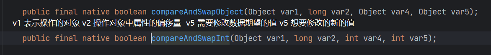
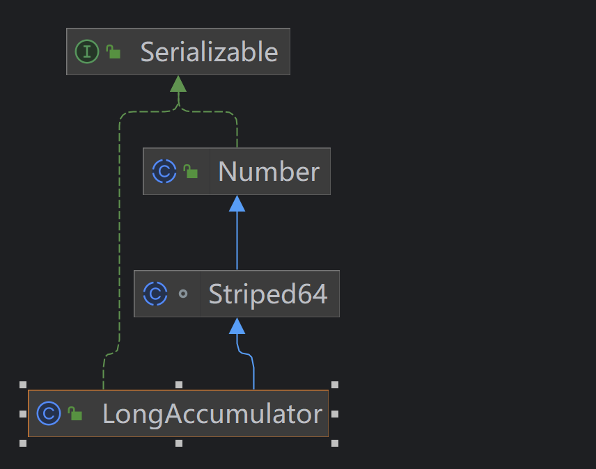

[1. 线程基础知识复习 · 语雀](https://www.yuque.com/gongxi-wssld/csm31d/ln0mq1w7wp1oy99g)
## 1 JUC 是什么
java. util. concurrent 在[并发编程](https://so.csdn.net/so/search?q=%E5%B9%B6%E5%8F%91%E7%BC%96%E7%A8%8B&spm=1001.2101.3001.7020)中使用的工具包


## 2 基础知识复习
线程分为以下内容
- 1把锁：synchronized（后面细讲）

- 2个并：
- 并发（concurrent）：是在同一实体上的多个事件，是在**一台机器**上“**同时**”处理多个任务，同一时刻，其实是**只有一个**事情再发生。
- 并行（parallel）：是在不同实体上的多个事件，是在**多台处理器**上同时处理多个任务，同一时刻，大家都在做事情，你做你的，我做我的，各干各的。

- 3个程：
- 进程：在系统中运行的一个应用程序，每个进程都有它自己的内存空间和系统资源
- 线程：也被称为轻量级进程，在同一个进程内会有1个或多个线程，是大多数操作系统进行时序调度的基本单元。
- 管程：Monitor（锁），也就是我们平时所说的锁。Monitor其实是一种**同步机制**，它的义务是保证（同一时间）只有一个线程可以访问被保护的数据和代码，JVM中同步是基于进入和退出监视器（Monitor管程对象）来实现的，每个对象实例都会有一个Monitor对象，Monitor对象和Java对象一同创建并销毁，底层由C++语言实现。

- 线程分类（一般不做特别说明配置，默认都是用户线程）：
- **用户线程**：是系统的工作线程，它会完成这个程序需要完成的业务操作。
- **守护线程**：是一种特殊的线程为其他线程服务的，在后台默默地完成一些系统性的任务，比如垃圾回收线程就是最典型的例子。守护线程作为一个服务线程，没有服务对象就没有必要继续运行了，如果用户线程全部结束了，意味着程序需要完成的业务操作已经结束了，系统可以退出了。所以假如当系统只剩下守护线程的时候，守护线程伴随着 JVM 一同结束工作。

用户线程和守护线程的关系类似老总和秘书，老总负责主要工作，秘书则负责一切杂活。
`setDaemon` 设置这个线程为守护线程
`isDaemon` 判断这个线程是否为守护线程

守护线程 demo：
```java
public class DaemonDemo {
    public static void main(String[] args) {
        Thread t1 = new Thread(() -> {
            System.out.println(Thread.currentThread().getName() + " 开始运行," + (Thread.currentThread().isDaemon() ? "守护线程" : "用户线程"));
            while (true) {

            }
        }, "t1");
        t1.setDaemon(true);//通过设置属性Daemon来设置当前线程是否为守护线程
        t1.start();
        try {
            TimeUnit.SECONDS.sleep(3);
        } catch (InterruptedException e) {
            e.printStackTrace();
        }

        System.out.println(Thread.currentThread().getName() + " 主线程结束");
    }
}
```


# 2.1 Future 接口理论知识复习
Future接口（FutureTask实现类）定义了操作`异步任务`执行一些方法，如获取异步任务的执行结果、取消异步任务的执行、判断任务是否被取消、判断任务执行是否完毕等。

举例：比如主线程让一个子线程去执行任务，子线程可能比较耗时，启动子线程开始执行任务后，主线程就去做其他事情了，忙完其他事情或者先执行完，过了一会再才去获取子任务的执行结果或变更的任务状态（老师上课时间想喝水，他继续讲课不结束上课这个主线程，让学生去小卖部帮老师买水完成这个耗时和费力的任务）。 


# Callable 接口复习
`Callable` 接口是 Java 提供的一个并发编程工具，它与另一个接口 `Runnable` 类似，都用于表示可以在多线程环境中执行的任务。但是，`Callable` 接口在某些方面与 `Runnable` 有所不同：
1. 返回结果：`Runnable` 的 `run()` 方法没有返回值，而 `Callable` 的 `call()` 方法可以返回一个结果。`call()` 方法使用 `Future` 对象进行包装，可以用于获取执行结果，或者在任务完成时阻塞地获取结果。
   
2. 抛出异常：`Runnable` 的 `run()` 方法不能抛出受检查的异常（checked exception），只能通过捕获并在内部处理。而 `Callable` 的 `call()` 方法可以抛出受检查的异常，允许在任务执行过程中抛出异常。

```java
public interface Callable<V> {
    V call() throws Exception;
}
```

其中，`V` 是任务执行完毕后的返回结果类型。

# 2.2.1 Future 接口能干什么
Future 是 Java5新加的一个接口，它提供一种异步并行计算的功能，如果主线程需要执行一个很耗时的计算任务，我们会就可以通过 Future 把这个任务放进异步线程中执行，主线程继续处理其他任务或者先行结束，再通过 Future 获取计算结果。 

# Future 接口相关架构
- 目的：异步多线程任务执行且返回有结果，三个特点：多线程、有返回、异步任务（班长为老师去买水作为新启动的异步多线程任务且买到水有结果返回）
- 代码实现：Runnable 接口+Callable 接口+Future 接口和 FutureTask 实现类。 


FutureTask 开启异步任务：
```java
public class FutureTest {  
public static void main(String[] args) throws ExecutionException, InterruptedException {  
Cat cat = new Cat();  
FutureTask<String> stringFutureTask = new FutureTask<>(cat);  
new Thread(stringFutureTask).start();  
System.out.println("main end~");  
System.out.println(stringFutureTask.get());  
}  
}  
  
class Cat implements Callable<String> {  
  
@Override  
public String call() throws Exception {  
System.out.println("cat coin in~");  
return "喵喵喵~";  
}  
}
```

# Future 编码实战和优缺点分析
- 优点：Future+线程池异步多线程任务配合，能显著提高程序的运行效率。
---
- 缺点：
	- - get ()阻塞---一旦调用 get ()方法求结果，一旦调用不见不散，非要等到结果才会离开，不管你是否计算完成，如果没有计算完成容易程序堵塞。
	- IsDone ()轮询---轮询的方式会耗费无谓的 cpu 资源，而且也不见得能及时得到计算结果，如果想要异步获取结果，通常会以轮询的方式去获取结果，尽量不要阻塞。
---
-  结论：Future 对于结果的获取不是很友好，只能通过**阻塞或轮询**的方式得到任务的结果。

Demo
```java
public class FutureApiDemo {
    public static void main(String[] args) throws ExecutionException, InterruptedException, TimeoutException {
        FutureTask<String> futureTask = new FutureTask<>(() -> {
            System.out.println(Thread.currentThread().getName() + "--------come in");
            try {
                TimeUnit.SECONDS.sleep(5);
            } catch (InterruptedException e) {
                e.printStackTrace();
            }
            return "task over";
        });

        Thread t1 = new Thread(futureTask, "t1");
        t1.start();

//        System.out.println(futureTask.get());//这样会有阻塞的可能，在程序没有计算完毕的情况下。
        System.out.println(Thread.currentThread().getName() + " ------忙其他任务");
//        System.out.println(futureTask.get(3,TimeUnit.SECONDS));//只愿意等待三秒，计算未完成直接抛出异常
        while (true) {//轮询
            if(futureTask.isDone()){
                System.out.println(futureTask.get());
                break;
            }else{
                TimeUnit.MILLISECONDS.sleep(500);
                System.out.println("正在处理中，不要催了，越催越慢");
            }
        }
        /* 轮询结果
        * main ------忙其他任务
        t1--------come in
        正在处理中，不要催了，越催越慢
        正在处理中，不要催了，越催越慢
        正在处理中，不要催了，越催越慢
        正在处理中，不要催了，越催越慢
        正在处理中，不要催了，越催越慢
        正在处理中，不要催了，越催越慢
        正在处理中，不要催了，越催越慢
        正在处理中，不要催了，越催越慢
        正在处理中，不要催了，越催越慢
        正在处理中，不要催了，越催越慢
        task over
        Process finished with exit code 0
        * */
    }
}
```

# 多线程完成一些复杂的任务
- 对于简单的业务场景使用 Future 完全 ok

- 回调通知：
- 应对Future的完成时间，完成了可以告诉我，也就是我们的回调通知
- 通过轮询的方式去判断任务是否完成这样非常占cpu并且代码也不优雅

- 创建异步任务：Future+线程池组合
- 多个任务前后依赖可以组合处理（水煮鱼--->买鱼--->调料--->下锅）：
- 想将多个异步任务的结果组合起来，后一个异步任务的计算结果需要钱一个异步任务的值
- 想将两个或多个异步计算合并成为一个异步计算，这几个异步计算互相独立，同时后面这个又依赖前一个处理的结果

- 对计算速度选最快的：
- 当Future集合中某个任务最快结束时，返回结果，返回第一名处理结果

- **结论**：
- 使用Future之前提供的那点API就囊中羞涩，处理起来不够优雅，这时候还是让CompletableFuture以声明式的方式优雅的处理这些需求。
- 从i到i++
- Future 能干的，`CompletableFuture` 都能干

# CompletableFuture 为什么会出现
- get ()方法在 Future 计算完成之前会一直处在阻塞状态下，阻塞的方式和异步编程的设计理念相违背。
- isDene()方法容易耗费cpu资源（cpu空转），
- 对于真正的异步处理我们希望是可以通过传入回调函数，在Future结束时自动调用该回调函数，这样，我们就不用等待结果

jdk8设计出 CompletableFuture，CompletableFuture 提供了一种观察者模式类似的机制，可以让任务执行完成后通知监听的一方。 

## CompletableFuture 和 CompletionStage 介绍

- **接口 CompletionStage**
- 代表异步计算过程中的某一个阶段，一个阶段完成以后可能会触发另外一个阶段。
- 一个阶段的执行可能是被单个阶段的完成触发，也可能是由多个阶段一起触发
---
- **类 CompletableFuture**
- 提供了非常强大的 Future 的扩展功能，可以帮助我们简化异步编程的复杂性，并且提供了函数式编程的能力，可以通过回调的方式处理计算结果，也提供了转换和组合 CompletableFuture 的方法 
- 它可能代表一个明确完成的 Future，也可能代表一个完成阶段（CompletionStage），它支持在计算完成以后触发一些函数或执行某些动作 

## 核心的四个静态方法，来创建一个异步任务

对于上述 Executor 参数说明：若没有指定，则使用默认的 ForkJoinPoolcommonPool（）作为它的线程池执行异步代码，如果指定线程池，则使用我们自定义的或者特别指定的线程池执行异步代码。
官方推荐使用静态方法创建异步任务。
**当使用系统默认线程池时，主线程的结束，线程池也会随着关闭，也会导致其他使用默认线程池的线程结束。**
方法 demo：
```java
/**  
* @author ZhangMinlei  
* @description  
* @date 2023-07-21 13:30  
*/  
public class CompletableFutureTest {  
public static void main(String[] args) throws ExecutionException, InterruptedException {  
// 创建线程池  
ExecutorService executorService = Executors.newFixedThreadPool(3);  
// 启动一个使用默认线程池的异步任务 没有返回值  
CompletableFuture<Void> future1 = CompletableFuture.runAsync(() -> System.out.println("future1"));  
System.out.println(future1.get());  
  
// 启动一个使用自己线程池的异步任务 没有返回值  
  
CompletableFuture<Void> future2 = CompletableFuture.runAsync(() -> System.out.println("future2"), executorService);  
System.out.println(future2.get());  
  
// 启动一个使用自己线程池，有返回值  
CompletableFuture<Integer> future3 = CompletableFuture.supplyAsync(() -> {  
System.out.println(123);  
return 1;  
}, executorService);  
System.out.println(future3.get());  
}  
}
```

CompletableFuture 减少阻塞和轮询，可以传入回调对象，当异步任务完成或者发生异常时，自动调用回调对象的回调方法。 
`whenComplete` 拿到上一个任务的返回值继续执行下一个任务
`exceptionally` 异常处理任务
Demo
```java
public class CompletableFutureTest2 {  
public static void main(String[] args) {  
ExecutorService executorService = Executors.newFixedThreadPool(3);  
  
CompletableFuture.supplyAsync(() -> {  
System.out.println("123");  
// int i = 10 /0;  
return 3;  
}, executorService).whenComplete((integer, throwable) -> {  
if (throwable == null) {  
System.out.println("计算结果正常没有错误");  
}  
System.out.println(integer);  
}).exceptionally(throwable -> {  
throwable.printStackTrace();  
System.out.println("出现了异常");  
return null;  
});  
executorService.shutdownNow();  
}  
}
```

CompletableFuture 优点：
- 异步任务**结束**时，会自动回调某个对象的方法
- 主线程设置好回调后，不用关心异步任务的执行，异步任务之间可以顺序执行
- 异步任务**出错**时，会自动回调某个对象的方法

# 案例精讲 -从电商网站的比价需求展开
## 函数式编程已成为主流
Lambda 表达式+Stream 流式调用+Chain 链式调用+Java8函数式编程

**函数时接口：**


`get()` 方法和 `join()` 方法都是用于等待异步任务完成并获取结果的方法：

- `get()` 方法从 `Future` 接口继承而来，会抛出 `ExecutionException` 和 `InterruptedException`，需要处理异常。

- `join()` 方法是 `CompletableFuture` 特有的方法，会抛出 `CompletionException`，不会抛出受检查的异常，更适合用于流式操作或简化代码。

# 大厂业务需求案例说明
切记：功能--->性能（完成--->完美）

**需求分析：**
1. 需求说明：
	1. 同一款产品，同时搜索出同款产品在各大电商平台的售价
	2. 同一款产品，同时搜索出本产品在同一个电商平台下，各个入驻卖家售价是多少
	3. 同一本书，在京东入驻的每一个商家卖多少钱，在淘宝入驻的每一个商家卖多少钱，

## 一波流 Java8函数式编程带走 -比价案例实战 Case
Demo：
```java
package CompletableFuture;  
  
import lombok.AllArgsConstructor;  
import lombok.Data;  
import lombok.NoArgsConstructor;  
  
import java.util.ArrayList;  
import java.util.List;  
import java.util.concurrent.CompletableFuture;  
import java.util.concurrent.ThreadLocalRandom;  
import java.util.concurrent.TimeUnit;  
import java.util.stream.Collectors;  
  
/**  
* @author ZhangMinlei  
* @description  
* @date 2023-07-21 18:02  
*/  
public class CompletableFutureTest4 {  
static List<NetAll> list = new ArrayList<>();  
  
public static void main(String[] args) {  
list.add(new NetAll("jd"));  
list.add(new NetAll("tb"));  
list.add(new NetAll("ddangdang"));  
// 单线程去查询  
List<String> list1 = get(list, "mysql");  
list1.forEach(System.out::println);  
System.out.println("------------------");  
// 多线程去查询  
List<String> list2 = get2(list, "mysql");  
list2.forEach(System.out::println);  
}  
  
public static List<String> get(List<NetAll> list, String bookName) {  
// 单线程去查询  
return list.stream().map(netAll -> {  
return String.format(bookName + "在 %s 售价 %.2f元", netAll.getNetMallName(), netAll.getPrice());  
}).collect(Collectors.toList());  
}  
  
public static List<String> get2(List<NetAll> list, String bookName) {  
return list.stream().  
map(netAll -> CompletableFuture.supplyAsync(() ->  
String.format(bookName + "在 %s 售价 %.2f元", netAll.getNetMallName(), netAll.getPrice()))).collect(Collectors.toList()).  
stream().map(CompletableFuture::join).collect(Collectors.toList());  
}  
}  
  
@Data  
@NoArgsConstructor  
@AllArgsConstructor  
class NetAll {  
  
private String netMallName;  
  
public double getPrice() {  
try {  
TimeUnit.SECONDS.sleep(1);  
} catch (InterruptedException e) {  
throw new RuntimeException(e);  
}  
return ThreadLocalRandom.current().nextDouble() * 2 + netMallName.charAt(0);  
}  
}
```


## CompletableFuture 常用方法
**常用方法分类**
- **获得结果和触发计算**
	- 获取结果
		- public T get()
		- public T get(long timeout,TimeUnit unit)
		- public T join() --->和get一样的作用，只是不需要抛出异常
		- public T getNow (T valuelfAbsent) --->计算完成就返回正常值，否则返回备胎值（传入的参数），立即获取结果不阻塞。
	- 主动触发计算
		- public boolean complete (T value) ---->是否打断 get 方法立即返回括号值 

- **对计算结果进行处理**
	- thenApply --->计算结果存在依赖关系，这两个线程串行化---->由于存在依赖关系（当前步错，不走下一步），当前步骤有异常的话就叫停
	- handle --->计算结果存在依赖关系，这两个线程串行化---->有异常也可以往下走一步

Demo：
```java
package CompletableFuture;  
  
import java.util.concurrent.CompletableFuture;  
import java.util.concurrent.ExecutorService;  
import java.util.concurrent.Executors;  
import java.util.concurrent.TimeUnit;  
  
/**  
* @author ZhangMinlei  
* @description  
* @date 2023-07-21 19:10  
*/  
public class CompletableFutureApiDemo {  
public static void main(String[] args) throws InterruptedException {  
ExecutorService threadPool = Executors.newFixedThreadPool(3);  
// thenApply 方法演示 有异常就会终止  
CompletableFuture.supplyAsync(() -> {  
System.out.println(111);  
int i = 9 / 0;  
return "111";  
}).thenApply(r -> {  
System.out.println(222);  
return r + "222";  
}).exceptionally(throwable -> {  
if (throwable != null) {  
System.out.println("出现了异常");  
System.out.println(throwable.getMessage());  
}  
return null;  
});  
  
// handle 演示  
CompletableFuture.supplyAsync(() -> {  
System.out.println("1");  
return 1;  
}, threadPool).handle((i, e) -> {  
// 因为这里出现了异常，导致一下代码都不会执行，直接跳到地三个  
int w = 9 / 0;  
System.out.println(2);  
return i + 1;  
}).handle((i,e) -> {  
System.out.println(3);  
System.out.println("i = "+i);  
System.out.println(e.getMessage());  
return null;  
});  
System.out.println("主线程结束");  
threadPool.shutdownNow();  
}  
}
```

- **对计算结果进行消费**
-  接受任务的处理结果，并消费处理，无返回结果。类似充当一个消费者，只能将结果使用掉，并不会产生返回值。
- thenAccept
```java
@Test  
public void thenAccept() {  
CompletableFuture.supplyAsync(() -> "hello").thenAccept(System.out::println);  
}
```
- 对比补充
- thenRun (Runnable runnable) : 任务 A 执行完执行 B，并且不需要 A 的结果, 
- thenAccept(Consumer action): 任务A执行完执行B，B需要A的结果，但是任务B没有返回值
- thenApply (Function fn): 任务 A 执行完执行 B，B 需要 A 的结果，同时任务 B 有返回值
Demo：
```java
@Test  
public void thenATest() {  
CompletableFuture.supplyAsync(() -> "hello").thenAccept(System.out::println);  
CompletableFuture.supplyAsync(() -> "thenRun").thenRun(System.out::println);  
  
CompletableFuture.supplyAsync(() -> "thenApply").thenApply(f -> {  
System.out.println(f);  
return f;  
});  
}  
}
```

- CompletableFuture 和线程池说明
	- 如果没有传入自定义线程池，都用默认线程池 ForkJoinPool
	- 传入一个线程池，如果你执行第一个任务时，传入了一个自定义线程池
		- 调用thenRun方法执行第二个任务时，则第二个任务和第一个任务时共用同一个线程池
		- 调用thenRunAsync执行第二个任务时，则第一个任务使用的是你自定义的线程池，第二个任务使用的是ForkJoin线程池
	
	- 备注：有的时候可能是线程处理太快，系统优化切换原则，直接使用 main 线程处理，
	- thenAccept和thenAcceptAsync，thenApply和thenApplyAsync等，之间的区别同理。
```java
@Test  
public void thenAPool() {  
// 观察线程池可以看出，当启动xxxAsync方法时，会使用默认的线程池，而不是和上一个方法一致。  
ExecutorService executorService = Executors.newFixedThreadPool(3);  
CompletableFuture.runAsync(() -> System.out.println(1 + Thread.currentThread().getName()), executorService)  
.thenRunAsync(() -> System.out.println(1 + Thread.currentThread().getName()))  
.thenRun(() -> System.out.println(1 + Thread.currentThread().getName()));  
System.out.println("main end~");  
executorService.shutdownNow();  
}
```

- **对计算速度进行选用**
	- 谁快用谁
	- applyToEither
	Demo：
```java
// 模拟 a小线程完成需要2秒，b线程完成需要1秒， applyToEither方法使用处理快的返回结果来进行操作  
@Test  
public void applyToEitherTest() throws InterruptedException {  
ExecutorService executorService = Executors.newFixedThreadPool(3);  
CompletableFuture<String> planA = CompletableFuture.supplyAsync(() -> {  
try {  
Thread.sleep(200);  
} catch (InterruptedException e) {  
throw new RuntimeException(e);  
}  
System.out.println("A玩家~");  
return "A";  
}, executorService);  
  
CompletableFuture<String> planB = CompletableFuture.supplyAsync(() -> {  
try {  
Thread.sleep(1000);  
} catch (InterruptedException e) {  
throw new RuntimeException(e);  
}  
System.out.println("B玩家~");  
return "B";  
}, executorService);  
  
Thread.sleep(3000);  
CompletableFuture<String> result = planA.applyToEither(planB, f -> f + "获得胜利");  
  
System.out.println(result.join() + Thread.currentThread().getName());  
executorService.shutdownNow();  
}
```

- **对计算结果进行合并**
	
	- 两个CompletableStage任务都完成后，最终能把两个任务的结果一起交给thenCombine来处理
	- 先完成的先等着，等待其他分支任务
	- thenCombine 方法

Demo
```java
@Test  
public void thenCombineTest() {  
// 链式使用  
CompletableFuture.supplyAsync(() -> {  
System.out.println("1号");  
return 1;  
}).thenApply(x -> {  
System.out.println("2号");  
return 2;  
}).thenCombine(CompletableFuture.supplyAsync(() -> {  
System.out.println("3号");  
return 3;  
}), (x, y) -> {  
System.out.println("4号");  
System.out.println(x + y);  
return 4;  
});  
// 单独使用  
CompletableFuture<Integer> f1 = CompletableFuture.supplyAsync(() -> {  
System.out.println("A");  
return 2;  
});  
  
CompletableFuture<Integer> f2 = CompletableFuture.supplyAsync(() -> {  
System.out.println("A");  
return 2;  
});  
  
CompletableFuture<Object> result = f1.thenCombine(f2, (x, y) -> {  
System.out.println(x + y);  
return "任务结束~";  
});  
  
System.out.println(result.join());  
}
```

# 说说 Java"锁"事
## 从轻松的乐观锁和悲观锁开讲
- 悲观锁： 认为自己在使用数据的时候 **一定有别的线程来修改数据**，因此在获取数据的时候会先加锁，确保数据不会被别的线程修改，synchronized 和 Lock 的实现类都是悲观锁，**适合写操作多的场景**，先加锁可以保证写操作时数据正确，显示的锁定之后再操作同步资源-----狼性锁
- synchronized 关键字和 Lock 的实现都是悲观锁
---
- 乐观锁： 认为自己在使用数据的时候 `不会有别的线程修改数据或资源`，不会添加锁，Java 中使用无锁编程来实现，只是在更新的时候去判断，之前有没有别的线程更新了这个数据，如果这个数据没有被更新，当前线程将自己修改的数据成功写入，如果已经被其他线程更新，则根据不同的实现方式执行不同的操作，比如：放弃修改、重试抢锁等等。
	- 判断规则有：版本号机制 Version，`最常采用的是CAS算法，Java原子类中的递增操作就通过CAS自旋实现的。` ----- `适合读操作多的场景，` 不加锁的特性能够使其读操作的性能大幅提升，乐观锁则直接去操作同步资源，是一种无锁算法，得之我幸不得我命---佛系锁

## 锁相关的8种案例演示 code
```java
/**
 * @author Guanghao Wei
 * @create 2023-04-10 14:57
 */

class Phone {
    public synchronized void sendEmail() {
        try {
            TimeUnit.SECONDS.sleep(3);
        } catch (InterruptedException e) {
            e.printStackTrace();
        }
        System.out.println("------sendEmail");
    }

    public synchronized void sendSMS() {
        System.out.println("------sendSMS");
    }

    public void hello() {
        System.out.println("------hello");
    }
}

/**
 * 现象描述：
 * 1 标准访问ab两个线程，请问先打印邮件还是短信？ --------先邮件，后短信  共用一个对象锁
 * 2. sendEmail钟加入暂停3秒钟，请问先打印邮件还是短信？---------先邮件，后短信  共用一个对象锁
 * 3. 添加一个普通的hello方法，请问先打印普通方法还是邮件？ --------先hello，再邮件
 * 4. 有两部手机，请问先打印邮件还是短信？ ----先短信后邮件  资源没有争抢，不是同一个对象锁
 * 5. 有两个静态同步方法，一步手机， 请问先打印邮件还是短信？---------先邮件后短信  共用一个类锁
 * 6. 有两个静态同步方法，两部手机， 请问先打印邮件还是短信？ ----------先邮件后短信 共用一个类锁
 * 7. 有一个静态同步方法 一个普通同步方法，请问先打印邮件还是短信？ ---------先短信后邮件   一个用类锁一个用对象锁
 * 8. 有一个静态同步方法，一个普通同步方法，两部手机，请问先打印邮件还是短信？ -------先短信后邮件 一个类锁一个对象锁
 */

public class Lock8Demo {
    public static void main(String[] args) {
        Phone phone = new Phone();
        new Thread(() -> {
            phone.sendEmail();
        }, "a").start();

        try {
            TimeUnit.MILLISECONDS.sleep(200);
        } catch (InterruptedException e) {
            e.printStackTrace();
        }

        new Thread(() -> {
            phone.sendSMS();
        }, "b").start();
    }

}

```

 * 现象描述：
 * 1 标准访问 ab 两个线程，请问先打印邮件还是短信？ --------先邮件，后短信共用一个对象锁
 * 2. SendEmail 钟加入暂停 3 秒钟，请问先打印邮件还是短信？---------先邮件，后短信共用一个对象锁
 * 3. 添加一个普通的 hello 方法，请问先打印普通方法还是邮件？ --------先 hello，再邮件
 * 4. 有两部手机，请问先打印邮件还是短信？ ----先短信后邮件资源没有争抢，不是同一个对象锁
 * 5. 有两个静态同步方法，一步手机，请问先打印邮件还是短信？---------先邮件后短信共用一个类锁
 * 6. 有两个静态同步方法，两部手机，请问先打印邮件还是短信？ ----------先邮件后短信共用一个类锁
 * 7. 有一个静态同步方法一个普通同步方法，请问先打印邮件还是短信？ ---------先短信后邮件一个用类锁一个用对象锁
 * 8. 有一个静态同步方法，一个普通同步方法，两部手机，请问先打印邮件还是短信？ -------先短信后邮件一个类锁一个对象锁


结论：

- 对于普通同步方法，**锁的是当前实例对象**，通常指 this，所有的同步方法用的都是同一把锁--->实例对象本身，**当有一个线程进入到同步方法中时，其他线程只能等待，不能访问方法中其他的同步方法。**
- 对于静态同步方法，锁的时当前类的Class对象
- 对于同步方法块，锁的时 synchronized 括号内的对象

##  synchronized 有三种应用方式
- 作用于实例方法，当前实例加锁，进入同步代码块前要获得当前实例的锁；
- 作用于代码块，对括号里配置的对象加锁
- 作用于静态方法，当前类加锁，进去同步代码前要获得当前类对象的锁

## 从字节码角度分析 synchronized 实现
- javap -c (v 附加信息) ***. class 文件反编译
	- synchronized同步代码块
	- 实现使用的是 `monitorenter` 和 `monitorexit` 指令
	- 会有连个 `monitorexit` 是因为保证出现异常也要释放锁的情况。
	

- synchronized 普通同步方法
	
	- 调用指令将会检查方法的 `ACC_SYNCHRONIZED` 访问标志是否被设置，如果设置了，执行线程会将现持有 monitor 锁，然后再执行该方法，最后在方法完成（无论是否正常结束）时释放 monitor
	

- synchronized 静态同步方法
	
	- ACC_STATIC、ACC_SYNCHRONIZED 访问标志区分该方法是否是静态同步方法


## 反编译 synchronized 锁的是什么
面试题：为什么任何一个对象都可以成为一个锁？
	Java 中，所有类的基类都是 Object，而 Object 又继承了 ObjectMonitor，我们知道，java 的底层是 c++，对应链路：ObjectMonitor. java--->ObjectMonitor. cpp--->ObjectMonitor. hpp。在 ObjectMonitor. hpp 中有一个属性是记录单项线程的使用对象，
	每个对象天生都带着一个对象监视器，每一个被锁住的对象都会和 Monitor 关联起来。


总结：指针指向 Monitor 对象（也称为管程或监视器）的真实地址。每个对象都存在着一个 monitor 与之关联，当一个 monitor 被某个线程持有后，它便处于锁定状态。在 Java 虚拟机（HotSpot）中，monitor 是由 OnjectMonitor 实现的，其主要的数据结构如下（位于 HotSpot 虚拟机源码 ObjectMonitor. hpp 文件，C++实现）： 


# 公平锁和非公平锁
- 公平锁：是指多个线程按照申请锁的顺序来获取锁，这里类似于排队买票，先来的人先买，后来的人再队尾排着，这是公平的----- `Lock lock = new ReentrantLock (true)`---表示公平锁，先来先得。
---
- 非公平锁：是指多个线程获取锁的顺序并不是按照申请的顺序，有可能后申请的线程比先申请的线程优先获取锁，在高并发环境下，有可能造成优先级反转或者饥饿的状态（某个线程一直得不到锁）---- `Lock lock = new ReentrantLock (false)` ---表示非公平锁，后来的也可能先获得锁，默认为非公平锁。 

#面试题   **为什么会有公平锁/非公平锁的设计？为什么默认非公平？**

- 恢复挂起的线程到真正锁的获取还是有时间差的，从开发人员来看这个时间微乎其微，但是从 CPU 的角度来看，这个时间差存在的还是很明显的。**所以非公平锁能更充分地利用 CPU 的时间片，尽量减少 CPU 空间状态时间。**

- 使用多线程很重要的考量点是线程切**换的开销**，当采用非公平锁时，**当一个线程请求锁获取同步状态，然后释放同步状态，所以刚释放锁的线程在此刻再次获取同步状态的概率就变得很大，所以就减少了线程的开销**

- 什么时候用公平？什么时候用非公平？
	- 如果为了更高的吞吐量，很显然非公平锁是比较合适的，因为节省了很多线程切换的时间，吞吐量自然就上去了；否则就用公平锁，大家公平使用。

## 可重入锁 （递归锁）
是指在**同一线程**在外层方法获取到锁的时侯，在进入该线程的内层方法会**自动获取锁**（前提，锁对象的是同一个对象），不会因为之前已经获取过还没释放而阻塞---------优点之一就是可一定程度避免死锁。 
一个线程持有一个锁进入同一个同步资源，只有是同一把锁，就不会堵塞，直接通过。

## 可重入锁种类
- 隐式锁（即 `synchronized` 关键字使用的锁），默认是可重入锁
	- 在一个synchronized修饰的方法或者代码块的内部调用本类的其他`synchronized`修饰的方法或者代码块时，**是永远可以得到锁**。

- 显式锁（即 Lock）也有 `ReentrantLock` 这样的可重入锁。几次打开锁，就要几次释放锁，需要一一对应，否则造成系统堵塞。
Demo：
```java
@Test  
public void test() {  
// 此时他们持有的是一把锁，不会阻塞线程，直接进入。  
Object o = new Object();  
Thread thread = new Thread(() -> {  
System.out.println("1");  
synchronized (o){  
System.out.println("2");  
synchronized (o){  
System.out.println("3");  
}  
}  
});  
thread.start();  
}
```

`ReentrantLock` demo：
```java
public static void main(String[] args) {  
ReentrantLock lock = new ReentrantLock();  
lock.lock();  
System.out.println("come in");  
lock.unlock();  
try {  
lock.lock();  
System.out.println("lock~~~");  
} finally {  
lock.unlock();  
}  
new Thread(() -> {  
lock.lock();  
System.out.println("2");  
lock.unlock();  
}).start();  
}
```

# 死锁及排查
死锁是指两个或两个以上的线程在执行过程中，因**抢夺资源而造成的一种互相等待的现象**，若无外力干涉，**则它们无法再继续推进下去。** 

产生原因：
	- 系统资源不足
	- 进程运行推进顺序不合适
	- 系统资源分配不当
	


# 如何排查死锁
- 纯命令
	在 idea 终端输入指令，或者在项目路径下
	- jps -l
	- jstack 进程编号

- 图形化
	
	- jconsole

死锁 Demo：
```java
public static void main(String[] args) {  
Object a = new Object();  
Object b = new Object();  
  
new Thread(() -> {  
synchronized (a) {  
System.out.println("t1线程持有a锁，试图获取b锁");  
try {  
TimeUnit.SECONDS.sleep(1);  
} catch (InterruptedException e) {  
e.printStackTrace();  
}  
synchronized (b) {  
System.out.println("t1线程获取到b锁");  
}  
}  
}, "t1").start();  
  
new Thread(() -> {  
synchronized (b) {  
System.out.println("t2线程持有a锁，试图获取a锁");  
try {  
TimeUnit.SECONDS.sleep(1);  
} catch (InterruptedException e) {  
e.printStackTrace();  
}  
synchronized (a) {  
System.out.println("t2线程获取到a锁");  
}  
}  
}, "t2").start();  
}
```

指令


图形化


#  LockSupport 与线程中断
Java. lang. Thread 下的三个方法:


**什么是中断机制**？
- 首先，一个线程不应该由其他线程来强制中断或停止，而是应该由线程自己自行停止，自己来决定自己的命运，所以，Thread. stop, Thread. suspend, Thread. resume 都已经被废弃了
- 其次，在Java中没有办法立即停止一条线程，然而停止线程却显得尤为重要，如取消一个耗时操作。因此，`Java提供了一种用于停止线程的协商机制----中断，也即中断标识协商机制`
	- 中断只是一种协作协商机制，Java 没有给中断增加任何语法，中断的过程完全需要程序员自行实现。若要中断一个线程，你需要手动调用该线程 `interrupt` 方法，**该方法也仅仅是将该线程对象的中断标识设置为 true，接着你需要自己写代码不断检测当前线程的标识位，如果为 true，表示别的线程请求这条线程中断，此时究竟应该做什么需要你自己写代码实现。**
	- **每个线程对象都有一个中断标识位**，用于表示线程是否被中断；该标识位为 true 表示中断，为 false 表示未中断；通过调用线程对象的 `interrupt` 方法将该线程的标识位设置为 true；**可以在别的线程中调用，也可以在自己的线程中调用。**

# 中断的相关API方法之三大方法说明

- `public void interrupt ()`
	- 实例方法 Just to set the interrupt flag
	- 实例方法仅仅是设置线程的中断状态为true，发起一个协商而不会立刻停止线程

- `public static boolean interrupted()`
- 静态方法 Thread.interrupted();
- 判断线程是否被中断并清除当前中断状态（做了两件事情）
	
	- 1.返回当前线程的中断状态，测试当前线程是否已被中断
	- 2.将当前线程的中断状态清零并重新设置为false，清除线程的中断状态
	- 3.这个方法有点不好理解在于如果连续两次调用此方法，则第二次返回false，因为连续调用两次的结果可能不一样

- `public boolean isInterrupted()`
	
	- 实例方法
	- 判断当前线程是否被中断（通过检查中断标志位）

# 大厂面试题中断机制考点
 如何停止中断运行中的线程？
- 通过一个 volatile 变量实现
在Java中，`volatile` 是一个关键字，用于声明变量。它的主要作用是**保证可见性和禁止指令重排序**，用于确保多线程之间对该变量的访问是正确的。
Demo：
```java
public class VolatileTest {  
static volatile boolean flag = false;  
  
public static void main(String[] args) {  
new Thread(() -> {  
while (true) {  
if (flag) {  
System.out.println("t1 结束，flag 为ture");  
break;  
}  
System.out.println("t1 come in ");  
}  
}).start();  
  
new Thread(() -> {  
try {  
Thread.sleep(20);  
} catch (InterruptedException e) {  
throw new RuntimeException(e);  
}  
System.out.println("t2 come in ");  
flag = true;  
}).start();  
}  
}
```

- 通过 AutomicBoolean
Demo:
```java
ublic class InterruptDemo {
    static AtomicBoolean atomicBoolean = new AtomicBoolean(false);


    public static void main(String[] args) {
        new Thread(() -> {
            while (true) {
                if (atomicBoolean.get()) {
                    System.out.println(Thread.currentThread().getName() + " atomicBoolean的值被改为true，t1程序停止");
                    break;
                }
                System.out.println("-----------hello atomicBoolean");
            }
        }, "t1").start();
        try {
            TimeUnit.MILLISECONDS.sleep(10);
        } catch (InterruptedException e) {
            e.printStackTrace();
        }

        new Thread(() -> {
            atomicBoolean.set(true);
        }, "t2").start();

    }
}

/**
 * -----------hello atomicBoolean
 * -----------hello atomicBoolean
 * -----------hello atomicBoolean
 * -----------hello atomicBoolean
 * -----------hello atomicBoolean
 * t1 atomicBoolean的值被改为true，t1程序停止
 */
```

- 通过 Thread 类自带的中断 API 实例方法实现----在需要中断的线程中不断监听中断状态，一旦发生中断，就执行相应的中断处理业务逻辑 stop 线程。
Demo:
```java
@Test  
public void interruptedTest() {  
Thread thread1 = new Thread(() -> {  
while (true) {  
if (Thread.currentThread().isInterrupted()) {  
System.out.println("isInterrupted 被修改为ture ，程序终止");  
break;  
}  
System.out.println("你好！");  
}  
});  
  
thread1.start();  
  
new Thread(() ->{  
System.out.println("修改t1的isInterrupted为false");  
thread1.interrupt();  
}).start();  
}
```

- 当前线程的中断标识为 true，是不是线程就立刻停止？

答案是不立刻停止，具体来说，当对一个线程，调用interrupt时：

- 如果线程处于正常活动状态，那么会将该线程的中断标志设置为 true，仅此而已，被设置中断标志的线程将继续正常运行，不受影响，所以 interrupt ()并不能真正的中断线程，需要被调用的线程自己**进行配合才行**，**对于不活动的线程没有任何影响。** 

- 如果线程处于阻塞状态（例如 sleep, wait, join 状态等），在别的线程中调用当前线程对象的 interrupt 方法，那么线**程将立即退出被阻塞状态（interrupt 状态也将被清除）**，并抛出一个 InterruptedException 异常。 

**总之，需要记住的是中断只是一种协商机制，修改中断标识位仅此而已，不是立刻 stop 打断**

- 静态方法 `Thread. interrupted ()` 测试当前线程是否被打断，（中断标识为为 true），返回一个 boolean，并清除中断中断标识位。
- 第二次调用时，中断标识位的状态已经被清除，将返回一个 false。

Demo：
```java
public class InterruptDemo4 {
    public static void main(String[] args) {
        /**
         * main	false
         * main	false
         * -----------1
         * -----------2
         * main	true
         * main	false
         */
        System.out.println(Thread.currentThread().getName() + "\t" + Thread.interrupted());//false
        System.out.println(Thread.currentThread().getName() + "\t" + Thread.interrupted());//false
        System.out.println("-----------1");
        Thread.currentThread().interrupt();
        System.out.println("-----------2");
        System.out.println(Thread.currentThread().getName() + "\t" + Thread.interrupted());//true
        System.out.println(Thread.currentThread().getName() + "\t" + Thread.interrupted());//false

    }
}

false
false
1
2
true
false
```

对于静态方法 Thread.interrupted ()和实例方法 isInterrupted ()区别在于：
	- 静态方法interrupted将会清除中断状态（传入的参数ClearInterrupted为true）
	- 实例方法 isInterrupted 则不会（传入的参数 ClearInterrupted 为 false）
	- 他们底层实际都是调用了本地方法 `isInterrupted` 。


**总结**
- ` public void interrupt () ` 是一个实例方法，它通知目标线程中断，也仅仅是设置目标线程的中断标志位为 true
- `  public boolean isInterrupted()` 是一个实例方法，它判断当前线程是否被中断（通过检查中断标志位）并获取中断标志
- `public static boolean interrupted ()` 是一个静态方法，返回当前线程的中断真实状态（boolean 类型）后会将当前线程的中断状态设为 false，此方法调用之后会清楚当前线程的中断标志位的状态（将中断标志置为 false 了），返回当前值并清零置为 false。

# LockSupport
LockSupport 是用来创建锁和其他同步类的基本线程阻塞原语，其中 `park ()` 和 `unpack ()` 而作用分别是**阻塞线程和解除阻塞线程.** 

## 三种让线程等待和唤醒的方法
- 方式一：使用 Object 中的 wait ()方法让线程等待，使用 Object 中的 notify ()方法唤醒线程
- 方式二：使用JUC包中的Condition的await()方法让线程等待，使用signal()方法唤醒线程
- 方式三：LockSupport 类可以阻塞当前线程以及唤醒指定被阻塞的线程

**为什么会有 LockSupport 的出现？他解决了那些痛点和难题？** 思考

### Object 类中的 wait 和 notify 方法实现线程等待和唤醒
`wait` 和 `notify` 必须放在同步代码块中使用，却成对出现。
必须先 `wait` 再 `notify` 否则，无法唤起线程。
Demo：
```java
public class LockSupportTest {  
  
  
public static void main(String[] args) {  
// 此时如果在线程还没有wait的状态下去释放，会导致线程一致堵塞。  
Object o1 = new Object();  
new Thread(() -> {  
synchronized (o1) {  
System.out.println("t1 come in");  
try {  
System.out.println("t1 stop---");  
o1.wait();  
} catch (InterruptedException e) {  
throw new RuntimeException(e);  
}  
  
}  
}).start();  
  
CompletableFuture.runAsync(() ->  
{  
try {  
TimeUnit.SECONDS.sleep(1);  
} catch (InterruptedException e) {  
throw new RuntimeException(e);  
}  
synchronized (o1) {  
o1.notify();  
System.out.println("释放t1");  
}  
});  
}  
}
```

### Condition 接口中的 await 和 signal 方法实现线程的等待和唤醒
- Condition 中的线程等待和唤醒方法，需要先获取锁。
- 一定要先 await 后 signal，不要反了
```java
public class LockSupportDemo {  
  
public static void main(String[] args) {  
Lock lock = new ReentrantLock();  
Condition condition = lock.newCondition();  
/**  
* t1 -----------come in  
* t2 -----------发出通知  
* t1 -----------被唤醒  
*/  
new Thread(() -> {  
//获得锁
lock.lock();  
try {  
System.out.println(Thread.currentThread().getName() + "\t -----------come in");  
condition.await();  
System.out.println(Thread.currentThread().getName() + "\t -----------被唤醒");  
} catch (InterruptedException e) {  
e.printStackTrace();  
} finally {  
//释放锁
lock.unlock();  
}  
}, "t1").start();  
  
try {  
TimeUnit.SECONDS.sleep(1);  
} catch (InterruptedException e) {  
e.printStackTrace();  
}  
  
new Thread(() -> {  
lock.lock();  
try {  
condition.signal();  
System.out.println(Thread.currentThread().getName() + "\t -----------发出通知");  
} finally {  
lock.unlock();  
}  
}, "t2").start();  
}  
}
```

### 上述两个对象 Object 和 Condition 使用的限制条件
- 线程需要先获得并持有锁，必须在锁块（synchronized 或 lock）中
- 必须要先等待后唤醒，线程才能够被唤醒

### LockSupport 类中的 park 等待和 unpark 唤醒
- LockSupport 类使用了一种名为 `Permit`（许可）的概念来做到阻塞和唤醒线程的功能，每个线程都有一个许可（Permit），**许可证只能有一个，累加上限是1**。 

- 主要方法
	
	- 阻塞: `Peimit` 许可证默认没有不能放行，所以一开始调用 park ()方法当前线程会阻塞，直到别的线程给当前线程发放 peimit，park 方法才会被唤醒。 
	- 
	-` park/park (Object blocker)`-------阻塞当前线程/阻塞传入的具体线程 
	
	- 唤醒: 调用 unpack (thread)方法后就会将 thread 线程的许可证 peimit 发放，会自动唤醒 park 线程，即之前阻塞中的 LockSupport. park ()方法会立即返回。 
	- 
	- `unpark (Thread thread)` ------唤醒处于阻塞状态的指定线程 

```java
public class LockSupportTest2 {  
public static void main(String[] args) throws InterruptedException {  
Thread t1 = new Thread(() -> {  
System.out.println("t1");  
LockSupport.park();  
System.out.println("t2 end");  
});  
t1.start();  
TimeUnit.SECONDS.sleep(1);  
  
new Thread(() -> {  
System.out.println("t2");  
LockSupport.unpark(t1);  
System.out.println("释放t1");  
}).start();  
}  
}
```

重点说明：
	- **LockSupport 是用来创建锁和其他同步类的基本线程阻塞原语**，所有的方法都是静态方法，可以让线程再任意位置阻塞，阻塞后也有对应的唤醒方法。归根结底，LockSupport 时调用 Unsafe 中的 native 代码。
	-  `LockSupport` 提供 `park ()` 和 `unpark ()` 方法实现阻塞线程和解除线程阻塞的过程，LockSupport 和每个使用它的线程都有一个许可（Peimit）关联，每个线程都有一个相关的 permit，**peimit 最多只有一个**，**重复调用 unpark 也不会积累凭证。** 但是解除堵塞会消耗凭证。
	- 形象理解：线程阻塞需要消耗凭证（Permit），这个凭证最多只有一个
	- 当调用 park 时，如果有凭证，则会直接消耗掉这个凭证然后正常退出。如果没有凭证，则必须阻塞等待凭证可用；
	- 当调用 unpark 时，它会增加一个凭证，但凭证最多只能有 1 各，累加无效.

- 面试题 #面试题 

	**- 为什么LockSupport可以突破wait/notify的原有调用顺序？**
	
	- 因为unpark获得了一个凭证，之后再调用park方法，就可以名正言顺的凭证消费，故不会阻塞，先发放了凭证后续可以畅通无阻。
	
	- **为什么唤醒两次后阻塞两次，但最终结果还会阻塞线程？**
	
	- 因为凭证的数量最多为1，连续调用两次unpark和调用一次unpark效果一样，只会增加一个凭证，而调用两次park却需要消费两个凭证，证不够，不能放行。

# 计算机硬件存储体系

CPU 的运行**并不是直接操作内存而是先把内存里面的数据读到缓存**，而内存的读和写操作的时候会造成不一致的问题。JVM 规范中试图定义一种 Java 内存模型来屏蔽掉各种硬件和操作系统的内存访问差异，**以实现让 Java 程序再各种平台下都能达到一致性的内存访问效果。** 

# Java 内存模型 Java Memory Model
JMM（Java 内存模型 Java Memory Model）本身是一种**抽象的概念并不真实存在，它仅仅描述的是一组约定或规范**，通过这组规范定义了程序中（尤其是多线程）各个变量的读写访问方式并决定一个线程对共享变量的写入以及如何变成对另一个线程可见，**关键技术点都是围绕多线程的原子性、可见性和有序性展开的。** 
JMM 主要关注以下问题：
	- 原子性（Atomicity）：对于一些操作，要么全部执行成功，要么全部不执行，不存在中间状态。
	- 可见性（Visibility）：一个线程对共享变量的修改对其他线程是可见的。
	- 有序性（Ordering）：程序执行的结果是按照代码的顺序来保证的，即指令重排不会影响到单线程的执行结果。

**能干吗？**
- 通过 JMM 来实现**线程和主内存之间的抽象关系**
- 屏蔽各个**硬件平台和操作系统的内存访问差异以实现让 Java 程序再各种平台下都能达到一致性的内存访问效果。**

# JMM 规范下三大特性
- **可见性**：是指当一个线程修改了某一个共享变量的值，其他线程是否能够立即知道该变更，JMM 规定了所有的变量都存储在主内存中。
- 

系统中**主内存共享变量**数据修改被写入的时机是不确定的，多线程并发下很可能出现“脏读”，所以**每个线程都有自己的工作内存**，线程自己的工作内存中保存了该线程使用到的变量的**主内存副本拷贝**，线程对变量的所有**操作（读取、赋值等）都必须在线程自己的工作内存中进行，而不能够直接写入主内存中的变量**，不同线程之间也无法直接访问对方工作内存中的变量，线程间变量值的传递均需要通过主内存来完成。

线程脏读

```
主内存中有变量X，初始值为0
线程 A 要将 X 加1，先将 X=0拷贝到自己的私有内存中，然后更新 X 的值
线程 A 将更新后的 X 值回刷到主内存的时间是不固定的 
刚好在线程 A 没有回刷 x 到主内存时，线程 B 同样从主内存中读取 X，此时为0，和线程 A 一样的操作，最后期盼的 X=2就会变成 X=1
```

- **原子性**：指一个操作是不可被打断的，即多线程环境下，操作不能被其他线程干扰。

- **有序性**：对于一个线程的执行代码而言，我们总是习惯性地认为代码的执行总是从上到下，有序执行。*但为了提升性能，编译器和处理器通常会对指令序列进行重新排序。* Java 规范规定 JVM 线程内部维持顺序化语义，*即只要程序的最终结果与它顺序话执行的结果相等，那么指令的执行顺序可以与代码顺序不一致，* 此过程叫指令的重排序。 

- 优缺点：
	
	- JVM能根据处理器特性（CPU多级缓存系统、多核处理器等）适当的对机器指令进行重排序，使机器指令更符合CPU的执行特性，最大限度的发挥机器性能。
	- 但是指令重排可以保证**串行语义一致**，但没有义务**保证多线程的语义也一致**（即可能产生“脏读”），简单而言就是两行以上不相干的代码在执行的时候有可能先执行的不是第一条，**不见得是从上到下顺序执行**，执行顺序会被优化。

- 从源码到最终执行示例图：


- 单线程环境里确实能够保证程序最终执行结果和代码顺序执行的结果一致 
- 处理器在进行重排序时**必须考虑到**指令之间的**数据依赖性**
- 多线程环境中线程交替执行，由于编译器优化重排的存在，可能出现乱序现象，两个线程使用的变量能否保证一致性是无法确定的，结果无法预测。

# JMM 规范下多线程对变量的读写过程
由于 JVM 运行程序的实体是线程，而每个线程创建时 JVM 都会为其创建一个**工作内存（有的地方成为栈空间）**，工作内存是每个线程的私有数据区域，而 Java 内存模型中**规定所有变量都存储在主内存**，主内存是共享内存区域，所有线程都可以访问，但线程对变量的操作（读写赋值等）**必须在工作内存中进行**，
首先要将变量从主内存拷贝到线程自己的工作内存空间，然后对变量进行操作，操作完成后再将变量写回主内存，**不能直接操作主内存中的变量**，各个线程中的工作内存存储着主内存中的**变量副本拷贝**，因此**不同的线程无法访问对方的工作内存**，线程间的通信（传值）必须通过主内存来完成，其简要访问过程如下图： 


JMM 定义了线程和主内存之间的抽象关系：

- 线程之间的共享变量存储在主内存中（从硬件角度讲就是内存条）
- 每个线程都有一个自己的本地工作内存，本地工作内存中存储了该线程用来读写共享变量的副本（从硬件角度来说就是 CPU 的缓存） 

小总结：
	- 我们定义的所有共享变量都储存在**物理主内存中**
	- 每个线程都有自己独立的工作内存，里面保证该线程使用到的共享变量的副本（主内存中该变量的一份拷贝）
	- 线程对共享变量所有的操作都必须先在线程自己的工作内存中进行后写回主内存，不能直接从主内存在读写（不能越级）
	- 不同线程之间也无法直接访问其他线程的工作内存中的变量，线程间变量值的传递需要通过主内存来进行（同级不能互相访问）。

# JMM 规范下多线程先行发生原则之 happens-before
在 JVM 中，如果一个操作执行的结果需要对另一个操作可见或者代码重排序，那么这两个操作之间必须存在 happens-before（先行发生）原则，逻辑上的先后关系。
# x, y 案例说明

| x=5                | 线程 A 执行 |
| ------------------ | ----------- |
| y=x                | 线程 B 执行 |
| 上述称之为：写后读 |             |

问题？

y 是否等于5呢？
如果线程A的操作（x=5）happens-before（先行发生）线程B的操作(y=x)，那么可以确定线程B执行y=5一定成立；
如果他们不存在happens-before原则，那么y=5不一定成立
这就是 happens-before 原则的为例----------->**包含可见性和有序性的约束**

## 先行并发原则说明
如果 Java 内存模型中所有的有序性都仅靠 volatile 和 synchronized 来完成，那么有很多操作都将变得非常罗嗦，但是我们在编写 Java 并发代码的时候并没有察觉到这一点。

我们没有时时、处处、次次，添加 `volatile` 和 `synchronized` 来完成程序，这是因为 Java 语言中 JMM 原则下，**有一个“先行发生”（happens-before）的原则限制**和规矩，给你理好了规矩！ 

这个原则非常重要：**它是判断数据是否存在竞争，线程是否安全的非常有用的手段**。依赖这个原则，我们可以通过几条简单规则一揽子解决并发环境下两个操作之间是否可能存在冲突的所有问题，而不需要陷入 Java 内存模型晦涩难懂的底层编译原理之中。 
## happens -before 总原则
- 如果一个操作 happens-before 另一个操作，那么**第一个操作的执行结果将对第二个操作可见**，而且**第一个操作的执行顺序排在第二个操作之前** 
- 
- 如果两个操作之间存在 happens-before 关系，并不意味着一定要按照 happens-before 原则制定的顺序来执行。如果重排之后的执行结果与按照 happens-before 关系来执行的**结果一致**，那么这种重排序**并不非法**。 

## happens -before 之8条
从 JDK 5开始，Java 使用新的 JSR-133内存模型，提供了 happens-before 原则来辅助保证程序执行的原子性、可见性以及有序性的问题，它是判断数据是否存在竞争、线程是否安全的依据，happens-before 原则内容如下：

1. 次序规则：**一个线程内**，按照代码的顺序，**写在前面的操作先行发生于写在后面的操作**，也就是说前一个操作的结果可以被后续的操作获取（保证语义串行性，按照代码顺序执行）。比如前一个操作把变量x赋值为1，那后面一个操作肯定能知道x已经变成了1
2. 锁定规则：一个 unLock 操作先行发生于后面对同一个锁的 lock 操作（后面指时间上的先后）。只有释放了的锁，才能获得锁。
3. volatile变量规则：对一个volatile变量的写操作先行发生于后面对这个变量的读操作，前面的写对后面的读是**可见的**，这里的后面同样**指时间上的先后**
4. 传递规则：如果操作A先行发生于操作B，而操作B又先行发生于操作C，**则可以得出操作A先行发生于操作C。**
5. 线程启动规则（Thread start Rule）：`Thread` 对象的` start ()` 方法先行发生于此线程的每一个动作
6. 线程中断规则（Thread Interruption Rule）：
	1. 对线程 `interrupt ()` 方法的调用**先行发生于被中断线程的代码检测**到中断事件的发生
	2. 可以通过` Thread.interrupted ()`检测到是否发生中断 
	3. **也就是说你要先调用 interrupt ()方法设置过中断标志位，我才能检测到中断发生** 

7. 线程终止规则（Thread Termination Rule）：线程中的**所有操作都优先发生于对此线程的终止检测**，我们可以通过 isAlive ()等手段检测线程是否已经终止执行。  
9. 对象终结规则（Finalizer Rule）：一个对象的初始化完成（构造函数执行结束）先行发生于它的 finalize (）方法的开始------->对象没有完成初始化之前，是不能调用 finalized ()方法的, (finalize ()垃圾回收方法)

## happens -before 小总结
- 在 Java 语言里面，Happens-before 的语义本质上是一种可见性
- A happens-before B ,意味着A发生过的事情对B而言是可见的，无论A事件和B事件是否发生在同一线程里
- JVM的设计分为两部分：
	
	- 一部分是面向我们程序员提供的，也就是happens-before规则，它通俗易懂的向我们程序员阐述了一个强内存模型，我们只要理解happens-before规则，就可以编写并发安全的程序了
	- 另一部分是针对JVM实现的，为了尽可能少的对编译器和处理器做约束从而提升性能，JMM在不影响程序执行结果的前提下对其不做要求，即允许优化重排序，我们只要关注前者就好了，也就是理解happens-before规则即可，其他繁杂的内容由JMM规范结合操作系统给我们搞定，我们只写好代码即可。


### 案例说明
```java
private int value =0;
public int getValue(){
    return value;
}
public int setValue(){
    return ++value;
}
```
问题描述：假设存在线程 A 和 B，线程 A 先（时间上的先后）调用了 setValue ()方法，然后线程 B 调用了同一个对象的 getValue ()方法，那么线程 B 收到的返回值是什么？ 
答案：不一定
分析 happens-before 规则（规则5，6，7，8可以忽略，和代码无关）
	1 由于两个方法由不同线程调用，不满足一个线程的条件，不满足程序次序规则
	2 两个方法都没有用锁，不满足锁定规则
	3 变量没有使用volatile修饰，所以不满足volatile变量规则
	4 传递规则肯定不满足
综上：无法通过 happens-before 原则推导出线程 A happens-before 线程 B，虽然可以确定时间上线程 A 优于线程 B，但就是无法确定线程 B 获得的结果是什么，所以这段代码不是线程安全的

注意：
- 如果两个操作的执行次序无法从 happens-before 原则推导出来，那么就不能保证他们的有序性，虚拟机可以随意对他们进行重排序

如何修复？
- 把getter/setter方法都定义为synchronized方法------->不好，重量锁，并发性下降
```java
private int value =0;
public synchronized int getValue(){
    return value;
}
public synchronized int setValue(){
    return ++value;
}
```

- 把 Value 定义为 volatile 变量，由于 setter 方法对 value 的修改不依赖 value 的原值，满足 volatile 关键字使用场景
```java
/**
* 利用volatile保证读取操作的可见性，
* 利用synchronized保证符合操作的原子性结合使用锁和volatile变量来减少同步的开销
*/
private volatile int value =0;
public int getValue(){
    return value;
}
public synchronized int setValue(){
    return ++value;
}
```


# volatile 与 JMM
## 被 volatile 修饰的变量有两大特点
- 特点：
	
	- 可见性
	- 有序性：有排序要求，有时需要禁重排

- 内存语义：
	
	- 当写一个volatile变量时，JMM会把该线程对应的**本地内存中的共享变量值立即刷新回主内存中**
	- 当读一个volatile变量时，JMM会把该线程对应的本地内存设置为无效，**重新回到主内存中读取最新共享变量的值**
	- 所以volatile的写内存语义是**直接刷新到主内存中**，读的内存语义是**直接从主内存中读取**

- volatile凭什么可以保证可见性和有序性？
	- 因为内存屏障 Memory Barrier

## 内存屏障 （面试重点必须拿下） #面试题 
- vilatile 两大特性：
	
	- **可见**：写完后立即刷新回主内存并及时发出通知，大家可以去主内存拿最新版，前面的修改对后面所有线程可见
	- **有序性（禁重排）**：
	- 重排序是指编译器和处理器为了优化程序性能而对指令序列进行重新排序的一种手段，有时候会改变程序语句的先后顺序，若不存在数据依赖关系，可以重排序；存在数据依赖关系，禁止重排序；但重排后的指令绝对不能改变原有的串行语义！这点在并发设计中必须要重点考虑！

内存屏障（也称内存栅栏，屏障指令等）是一类同步屏障指令，是 CPU 或编译器在对内存随机访问的操作中的一个同步点，使得此点之前的**所有读写操作都执行后才可以开始执行此点之后的操作，避免代码重排序**。内存屏障其实就是一种 JVM 指令，Java 内存模型的重排规则会要求 Java 编译器在生成 JVM 指令时插入特定的内存屏障指令，通过这些内存屏障指令，volatile 实现了 Java 内存模型中的可见性和有序性（禁重排），**但 volatile 无法保证原子性**

- 内存屏障之前的所有**写操作都要回写到主内存**
- 内存屏障之后的所有**读操作都能获得内存屏障之前的所有写操作的最新结果**（实现了可见性）

写屏障 (Store Memory Barrier)：告诉处理器在写屏障之前将所有存储在缓存 (store buffers)中的数据同步到主内存，也就是说当看到 `Store` 屏障指令，就必须把该指令之前的所有写入指令执行完毕才能继续往下执行

读屏障 (Load Memory Barrier)：处理器在读屏障之后的读操作，都在读屏障之后执行。也就是说在 `Load` 屏障指令之后就能够保证后面的读取数据指令一定能够读取到最新的数据。 

因此重排序时，不允许把内存屏障之后的指令重排序到内存屏障之前。一句话：**对一个 volatile 变量的写，先行发生于任意后续对这个 volatile 变量的读，也叫写后读。**

## 内存屏障分类

粗分两种：
	- 读屏障（Load Barrier）：在读指令之前插入读屏障，让工作内存或 CPU 高速缓存当中的缓存数据失效，重新回到主内存中获取最新数据。
	- 写屏障（Store Barrier）：在写指令之后插入写屏障，强制把缓冲区的数据刷回到主内存中。

细分四种：


用自己的理解：内存屏障是多线程对于代码重排序中的一种限制和规则。切线程必须遵守此规则。


- 什么叫保证有序性？----->通过内存屏障禁重排
	
	- 重排序有可能影响程序的执行和实现，因此，我们有时候希望告诉JVM别自动重排序，我这里不需要重排序，一切听我的。
	- 对于编译器的重排序，JMM 会根据重排序的规则，禁止特定类型的编译器重排序。
	- 对于处理器的重排序，**Java 编译器在生成指令序列的适当位置，插入内存屏障指令，来禁止特定类型的处理器排序。**

- happens-before 之 volatile 变量规则


当第一个操作为 volatile 读时，不论第二个操作是什么，都不能重排序，这个操作保证了
volatile 读之后的操作不会被重排到 volatile 读之前。

当第一个操作为 volatile 写时，第二个操作为 volatile 读时，不能重排

当第二个操作为 volatile 写时，不论第一个操作是什么，都不能重排序，这个操作保证了 volatile 写之前的操作不会被重排到 volatile 写之后。

- JMM 就将内存屏障插入策略分为4种规则
	- 读屏障：在每个 volatile 读操作的**后面**插入一个 LoadLoad 屏障或者 LoadStore 屏障
	- 
	- - 写屏障：在每个 volatile 写操作的**前面**插入 StoreStore 屏障；在每个 volatile 写操作的**后面**插入 StoreLoad 屏障；
	- 


## volatile 特性保证可见性
**保证不同线程对某个变量完成操作后结果及时可见，即该共享变量一旦改变所有线程立即可见**

- Code
	
	- 不加volatile，没有可见性，程序无法停止
	- 加了 volatile，保证可见性，程序可以停止

```java
public class VolatileSeeTest {  
  
static volatile boolean flag = true;  
  
public static void main(String[] args) throws InterruptedException {  
  
new Thread(() -> {  
System.out.println("t1 进入");  
while (flag) {  
  
}  
System.out.println("程序终止！");  
}).start();  
  
// 即时休眠1秒之后修改flag的值，该值也会影响到另外一个下城，加了volatile关键字的变量是全线程可见的。  
TimeUnit.SECONDS.sleep(1);  
flag = false;  
System.out.println("falg = " + flag);  
}  
}
```

- volatile 变量的读写过程（了解即可）

前六部在多线程和单个线程下都没有问题，为了防止在多线程下的写操作出现问题，有了后面两步操作，加锁和解锁。


## volatile 变量的符合操作不具有原子性
volatile变量的符合操作不具有原子性
	- 对于 voaltile 变量具备可见性，JVM 只是保证**从主内存加载到线程工作内存的值是最新的**，也仅仅是数据加载时是最新的。但是多线程环境下，“数据计算”和“数据赋值”操作可能多次出现，若数据在加载之后，若主内存 volatile 修饰变量发生修改之后，线程工作内存的操作将会作废去读主内存最新值，**操作出现写丢失问题**。即**各线程私有内存和主内存公共内存中变量不同步**，进而导致数据不一致。由此可见 volatile 解决的是变量读时的可见性问题，但无法保证原子性，对于**多线程修改主内存共享变量的场景必须加锁同步。** 
	- 至于怎么去理解这个写丢失的问题，就是再将数据读取到本地内存到写回主内存中有三个步骤：**数据加载---->数据计算---->数据赋值**，如果第二个线程在第一个线程读取旧值与写回新值期间读取共享变量的值，那么第二个线程将会与第一个线程一起看到同一个值，并执行自己的操作，一旦其中一个线程对 volatile 修饰的变量先行完成操作刷回主内存后，另一个线程会作废自己的操作，然后重新去读取最新的值再进行操作，这样的话，它自身的那一次操作就丢失了，这就造成了线程安全失败，因此，这个问题需要使用 `synchronized` 修饰以保证线程安全性。 
	- 结论：**volatile 变量不适合参与到依赖当前值的运算，如 i++，i=i+1之类的，通常用来保存某个状态的 boolean 值或者 int 值**，也正是由于 volatile 变量只能保证可见性，在不符合以下规则的运算场景中，

- 我们仍然要通过加锁来保证原子性： 
	
	- 运算结果并不依赖变量的当前值，或者能够确保只有单一的线程修改变量的值。
	- 变量不需要与其他的状态变量共同参与不变约束。
	
	- 面试回答为什么不具备原子性：举例i++的例子，在字节码文件中，i++分为三部，间隙期间不同步非原子操作
	
	- **对于volatile变量，JVM只是保证从主内存加载到线程工作内存的值是最新的，也就是数据加载时是最新的，如果第二个线程在第一个线程读取旧值和写回新值期间读取i的域值，也就造成了线程安全问题。**
- 

## 6.3.3 指令禁重排

volatile 实现禁止重拍序的底层是内存屏障。
	- 在每一个 volatile 写操作前面插入一个 StoreStore 屏障--->StoreStore 屏障可以保证在 volatile 写之前，其前面所有的普通写操作都已经刷新到主内存中。
	- 在每一个volatile写操作后面插入一个StoreLoad屏障--->StoreLoad屏障的作用是避免volatile写与后面可能有的volatile读/写操作重排序
	- 在每一个volatile读操作后面插入一个LoadLoad屏障--->LoadLoad屏障用来禁止处理器把上面的volatile读与下面的普通读重排序
	- 在每一个 volatile 读操作后面插入一个 LoadStore 屏障--->LoadTore 屏障用来禁止处理器把上面的 volatile 读与下面的普通写重排序

- 案例说明（volatile 读写前或后加了屏障保证有序性）：


## 如何正确使用 volatile
- 单一赋值可以，但是含复合运算赋值不可以（i++之类的）
	- - volatile int a = 10;
	- volatile boolean flag = true;

- 状态标志，判断业务是否结束
	- 作为一个布尔状态标志，用于指示发生了一个重要的一次性事件，例如完成初始化或任务结束
	- 

- 开销较低的读，写锁策略
	
	- 当读远多于写，结合使用内部锁和volatile变量来减少同步的开销
	- 原理是：利用volatile保证读操作的可见性，利用synchronized保证符合操作的原子性
	- 

- DCL双端锁的发布
	
	- 问题描述：首先设定一个加锁的单例模式场景
	- 
	
	- 在单线程环境下（或者说正常情况下），在“问题代码处”，会执行以下操作，保证能获取到已完成初始化的实例：
	- 
	- 隐患：在多线程环境下，在“问题代码处”，会执行以下操作，由于重排序导致2，3乱序，后果就是其他线程得到的是null而不是完成初始化的对象，其中第3步中实例化分多步执行（分配内存空间、初始化对象、将对象指向分配的内存空间），某些编译器为了性能原因，会将第二步和第三步重排序，这样某个线程肯能会获得一个未完全初始化的实例：
	- 
	
	- 多线程下的解决方案：加volatile修饰
		- 

## 6.5 本章最后的小总结


## olatile 没有原子性

## 6.5.3 volatile禁重排


## 6.5.4 凭什么我们Java写了一个volatile关键字，系统底层加入内存屏障？两者的关系如何勾搭？


## 6.5.5 内存屏障是什么？

是一种屏障指令，它使得CPU或编译器对屏障指令的前和后所发出的内存操作执行一个排序的约束。也称为内存栅栏或栅栏指令。

## 6.5.6 内存屏障能干吗？

- 阻止屏障两边的指令重排序
- 写操作时加入屏障，强制将线程私有工作内存的数据刷回主物理内存
- 读操作时加入屏障，线程私有工作内存的数据失效，重新回到主物理内存中获取最新值

## 6.5.7 内存屏障四大指令


## 6.5.8 3句话总结

- volatile写之前的操作，都禁止重排序到volatile之后
- volatile读之后的操作，都禁止重排序到volatile之前
- volatile 写之后 volatile 读，禁止重排序

# CAS
## 原子类
Java. util. concurrent. atomic


## CAS 
没有 CAS 时：
多线程环境中不使用原子类保证线程安全 i++（基本数据类型）

```java
class Test {
        private volatile int count = 0;
        //若要线程安全执行执行count++，需要加锁
        public synchronized void increment() {
                  count++;
        }

        public int getCount() {
                  return count;
        }
}
```

使用 CAS：
多线程环境中使用原子类保证线程安全 i++（基本数据类型）---------->类似于乐观锁
```java
class Test2 {
        private AtomicInteger count = new AtomicInteger();

        public void increment() {
                  count.incrementAndGet();
        }
      //使用AtomicInteger之后，不需要加锁，也可以实现线程安全。
       public int getCount() {
                return count.get();
        }
}
```


CAS (compare and swap)，中文翻译为比较并交换，实现并发算法时常用到的一种技术，用于保证共享变量的**原子性更新**，它包含三个操作数---内存位置、预期原值与更新值。

执行 CAS 操作的时候，将内存位置的值与预期原值进行比较：
	- 如果相匹配，那么处理器会自动将该位置更新为新值
	- 如果不匹配，处理器不做任何操作，多个线程同时执行CAS操作只有一个会成功。


CASDemo:
```java
/**  
* @author ZhangMinlei  
* @description  
* @date 2023-07-23 17:09  
*/  
public class CasTest {  
public static void main(String[] args) {  
// AtomicInteger构造器传入的参数为初始值，  
AtomicInteger atomicInteger = new AtomicInteger(5);  
// compareAndSet会拿 expect 参数和 初始值比较（5） 如果相等，说明没有修改过，将值修改为10 也就是 update参数的值，  
// 如果不相等，不作操作  
atomicInteger.compareAndSet(0,10);  
System.out.println(atomicInteger.get());  
}  
}
```

底层源码解析


## CAS 底层原理 ？谈谈对 Unsafe 类的理解？
`Unsafe` 类是 CAS 的核心类，由于 Java 方法无法直接访问底层系统，需要通过本地（native）方法来访问，Unsafe 相当于一个后门，基于该类可以直接操作特定内存的数据。Unsafe 类存在于 sun. misc 包中，其内部方法操作可以像 C 的指针一样直接操作内存，因此 Java 中 CAS 操作的执行依赖于 Unsafe 类的方法。

注意：Unsafe类中的所有方法都是native修饰的，也就是说Unsafe类中的所有方法都直接调用操作系统底层资源执行相应任务。

问题：我们知道i++是线程不安全的，那AtomicInteger.getAndIncrement()如何保证原子性？

AtomicInteger类主要利用CAS+volatile和native方法来保证原子操作，从而避免synchronized的高开销，执行效率大为提升：


CAS 并发原语体现在 Java 语言中就是 sun. misc. Unsafe 类中的各个方法。调用 Unsafe 类中的 CAS 方法，JVM 会帮我们实现出 CAS **汇编指令**。**这是一种完全依赖于硬件的功能，通过它实现了原子操作**。再次强调，由于 CAS 是一种系统原语，原语属于**操作系统用语范畴**，是由**若干条指令**组成的，用于完成某个功能的一个过程，并且**原语的执行必须是连续的**，在执行过程中**不允许被中断**，也就是说 **CAS 是一条 CPU 的原子指令**，不会造成所谓的数据不一致问题。 

### 源码分析


### 底层汇编


JDK 提供的 CAS 机制，在汇编层级会禁止变量两侧的指令优化，然后使用 compxchg 指令比较并更新变量值（原子性）
总结：
	- CAS是靠硬件实现的从而在硬件层面提升效率，最底层还是交给硬件来保证原子性和可见性
	- 实现方式是基于硬件平台的汇编指令，在inter的CPU中，使用的是汇编指令compxchg指令
	- 核心思想就是比较要更新变量 V 的值和预期值 E，相等才会将 V 的值设为新值 N，如果不相等自旋再来


## 原子引用

讲一个对象，封装为原子对象，可以使用 cas 的方法。

使用演示
```java
@Test  
public void atomicReferenceTest() {  
User user1 = new User("张三", 12);  
User user2 = new User("李四", 15);  
// 创建一个存放user 的原子容器  
AtomicReference<User> userAtomicReference = new AtomicReference<>();  
// 将user1 这个对象设置进去  
userAtomicReference.set(user1);  
// 比较默认值是否为user1 ，如果是 就修改为user2，反之没有操作。  
System.out.println(userAtomicReference.compareAndSet(user1, user2) + userAtomicReference.get().toString());  
System.out.println(userAtomicReference.compareAndSet(user1, user2) + userAtomicReference.get().toString());  
}  
}  
  
@Data  
@NoArgsConstructor  
@AllArgsConstructor  
class User {  
private String name;  
private Integer age;  
}
```

## CAS 与自旋锁，借鉴 CAS 思想
自旋锁：
	CAS 是实现自旋锁的基础，CAS 利用 CPU 指令保证了操作的原子性，以达到锁的效果，至于自旋锁---字面意思自己旋转。**是指尝试获取锁的线程不会立即阻塞，而是采用循环的方式去尝试获取锁**，当线程发现锁被占用时，**会不断循环判断锁的状态**，直到获取。这样的好处是减少线程上下文切换的消耗，缺点是循环会**消耗 CPU**。 

## 自己实现一个自旋锁 spinLockDemo

题目：实现一个自旋锁，借鉴 CAS 思想
通过 CAS 完成自旋锁，A 线程先进来调用 myLock 方法自己持有锁5秒钟，B 随后进来后发现当前有线程持有锁，所以只能通过自旋等待，直到 A 释放锁后 B 随后抢到。

当线程 A 上锁之后，会占用锁 5 秒，此时线程 B 启动，因为此时的默认值不是 `null`，线程 B 会在 while 循环抢锁，当 5 s 过去，此时线程 A 释放锁，将默认值设置为 null，此时线程 B 就会抢到锁，进行操作。
```java
package com.zml.cas;  
  
import java.util.concurrent.TimeUnit;  
import java.util.concurrent.atomic.AtomicReference;  
  
/**  
* @author ZhangMinlei  
* @description  
* @date 2023-07-23 18:34  
*/  
public class SpinLockDemo {  
  
AtomicReference<Thread> atomicReference = new AtomicReference<>();  
  
public void lock() {  
// 获取当前线程  
Thread thread = Thread.currentThread();  
System.out.println("start");  
// 我们要上锁，希望当前没有任何值，所以预期值为空，修改值为现在的线程对象  
while (!atomicReference.compareAndSet(null, thread)) {  
  
}  
}  
  
public void unlock() {  
// 获取当前线程对象  
Thread thread = Thread.currentThread();  
System.out.println("over~");  
// 我们要解锁，当前的预期值必须是我们自己的线程对象，才能解锁，保证原子性，最后将锁置空  
atomicReference.compareAndSet(thread, null);  
}  
  
public static void main(String[] args) {  
SpinLockDemo lock = new SpinLockDemo();  
new Thread(() -> {  
// 模拟占用锁5s  
lock.lock();  
try {  
TimeUnit.SECONDS.sleep(5);  
} catch (InterruptedException e) {  
throw new RuntimeException(e);  
}  
lock.unlock();  
}, "A").start();  
  
try {  
TimeUnit.MILLISECONDS.sleep(500);  
} catch (InterruptedException e) {  
throw new RuntimeException(e);  
}  
  
  
new Thread(() -> {  
lock.lock();  
lock.unlock();  
}, "B").start();  
}  
}
```

## CAS 的缺点
- 循环时间长开销很大
	- getAndAddInt 方法有一个 do while
	- 如果 CAS 失败，会一直进行尝试，如果 CAS 长时间一直不成功，可能会给 CPU 带来很大开销

- ABA 问题怎么产生的？
	- CAS 算法实现一个重要前提需要提取出内存中某时刻的数据并在当下时刻比较并替换，那么在这个时间差类会导致数据的变化。 
	- 比如说一个线程1从内存位置 V 中取出 A，这时候另一个线程2也从内存中取出 A，并且线程2进行了一些操作将值变成了 B，然后线程2又将 V 位置的数据变成 A，这时候线程1进行 CAS 操作发现内存中仍然是 A，预期 ok，然后线程1操作成功--------尽管线程1的 CAS 操作成功，但是不代表这个过程就是没有问题的。 
	- 通俗来说，有线程修改了资源，但是最后又将资源复原, 此时我们 cas  是检查不出来的。
		- 解决方案：版本号+CAS


## ABA 问题解决方案
带有戳记流水号的原子引用类


AtomicStampedReference带戳记流水的简单演示（单线程）：
```java
  
import lombok.AllArgsConstructor;  
import lombok.Data;  
  
import java.util.concurrent.atomic.AtomicStampedReference;  
  
/**  
* @author ZhangMinlei  
* @description  
* @date 2023-07-23 21:08  
*/  
public class atomicStampedReferenceTest {  
public static void main(String[] args) {  
Book javabook = new Book("java", 1);  
Book mysqlbook = new Book("mysql", 1);  
// 默认值是java这本书，流水号初始为1  
AtomicStampedReference<Book> reference = new AtomicStampedReference<Book>(javabook, 1);  
System.out.println(reference.getReference() + "\t" + reference.getStamp());  
boolean b;  
// 后两个参数表述 预期流水号，和修改后的流水号  
b = reference.compareAndSet(javabook, mysqlbook, reference.getStamp(), reference.getStamp() + 1);  
System.out.println(b + " " + reference.getStamp() + reference.getReference());  
b = reference.compareAndSet(mysqlbook, javabook, reference.getStamp(), reference.getStamp() + 1);  
System.out.println(b + " " + reference.getStamp() + reference.getReference());  
}  
}  
  
@Data  
@AllArgsConstructor  
class Book {  
private String name;  
private int id;  
}
```


多线程情况下演示 AtomicStampedReference 解决 ABA 问题
```java
// 多线程使用atomicStampedReference解决ABA问题  
@Test  
public void atomicStampedReferenceT2() throws InterruptedException {  
Book javabook = new Book("java", 1);  
Book mysqlbook = new Book("mysql", 1);  
AtomicStampedReference<Book> reference = new AtomicStampedReference<Book>(javabook, 1);  
  
new Thread(() -> {  
System.out.println("A线程开始修改~");  
reference.compareAndSet(javabook, mysqlbook, reference.getStamp(), reference.getStamp() + 1);  
reference.compareAndSet(mysqlbook, javabook, reference.getStamp(), reference.getStamp() + 1);  
System.out.println("A线程修改完毕，" + reference.getStamp() + reference.getReference());  
}, "A").start();  
  
TimeUnit.SECONDS.sleep(1);  
  
new Thread(() -> {  
System.out.println("B线程开始修改");  
boolean b = reference.compareAndSet(mysqlbook, javabook, reference.getStamp(), reference.getStamp() + 1);  
System.out.println("B线程修改结束" + reference.getStamp() + reference.getReference() +b);  
}, "B").start();  
}  
}  
  
  
@Data  
@AllArgsConstructor  
class Book {  
private String name;  
private int id;  
}
```


# 原子操作类
Atomic 翻译成中文是原子的意思。在化学上，我们知道原子是构成一般物质的最小单位，在化学反应中是不可分割的。在我们这里 Atomic 是指一个操作是不可中断的。即使是在多个线程一起执行的时候，一个操作一旦开始，就不会被其他线程干扰。

原子操作类可以分为一下几个大类：

## 基本类型原子类
- `AtomicInteger`：整型原子类
- `AtomicBoolean`：布尔型原子类
- `AtomicLong`：长整型原子类

**常用 API：**
```java
public final int get() //获取当前的值
public final int getAndSet(int newValue)//获取当前的值，并设置新的值
public final int getAndIncrement()//获取当前的值，并自增
public final int getAndDecrement() //获取当前的值，并自减
public final int getAndAdd(int delta) //获取当前的值，并加上预期的值
boolean compareAndSet(int expect, int update) //如果输入的数值等于预期值，则以原子方式将该值设置为输入值（update）
public final void lazySet(int newValue)//最终设置为newValue,使用 lazySet 设置之后可能导致其他线程在之后的一小段时间内还是可以读到旧的值。
```

**演示案例：**
CountDownLatch 类（计数器闭锁）是一个多线程同步工具，它的作用是允许一个或多个线程等待其他线程完成它们的操作，然后再继续执行。 
CountDownLatch 内部维护一个计数器，该计数器初始化为一个正整数，表示需要等待的线程数。每个线程执行完自己的任务后，可以通过调用 CountDownLatch 的 `countDown()` 方法来减少计数器的值。当计数器的值减到零时，所有等待的线程将被释放，可以继续执行。 

```java
package com.zml.atomicInteger;  
  
  
import java.util.concurrent.CountDownLatch;  
import java.util.concurrent.atomic.AtomicInteger;  
  
/**  
* @author ZhangMinlei  
* @description  
* @date 2023-07-24 11:53  
*/  
public class AtomicIntegerTest {  
public static final int SIZE = 50;  
  
public static void main(String[] args) throws InterruptedException {  
// 这里我们使用CountDownLatch来解决。  
CountDownLatch countDownLatch = new CountDownLatch(SIZE);  
MyNumber myNumber = new MyNumber();  
  
for (int i = 0; i < SIZE; i++) {  
new Thread(() -> {  
for (int j = 0; j < 1000; j++) {  
myNumber.getNumber();  
}  
countDownLatch.countDown();  
}).start();  
}  
// countDownLatch.await()会等待计数器的值为0才会运行，否则会堵塞进程，  
countDownLatch.await();  
// 此时我们直接获取值不是我们最终计算的结果，因为其他线程还没有算完main线程就把值取出来了。我们需要使用CountDownLatch  
System.out.println(myNumber.at.get());  
}  
}  
  
class MyNumber {  
public AtomicInteger at = new AtomicInteger();  
  
public void getNumber() {  
at.getAndIncrement();  
}  
}
```

## 数组类型原子类
- `AtomicIntegerArray`：整型数组原子类
- `AtomicLongrArray`：长整型数组原子类
- `AtomicReferenceArray`：用类型数组原子类

**常用 API**
```java
public final int get(int i) //获取 index=i 位置元素的值
public final int getAndSet(int i, int newValue)//返回 index=i 位置的当前的值，并将其设置为新值：newValue
public final int getAndIncrement(int i)//获取 index=i 位置元素的值，并让该位置的元素自增
public final int getAndDecrement(int i) //获取 index=i 位置元素的值，并让该位置的元素自减
public final int getAndAdd(int i, int delta) //获取 index=i 位置元素的值，并加上预期的值
boolean compareAndSet(int i, int expect, int update) //如果输入的数值等于预期值，则以原子方式将 index=i 位置的元素值设置为输入值（update）
public final void lazySet(int i, int newValue)//最终 将index=i 位置的元素设置为newValue,使用 lazySet 设置之后可能导致其他线程在之后的一小段时间内还是可以读到旧的值。
```

**演示案例：**
```java
public class AtomicIArray {  
public static void main(String[] args) {  
AtomicIntegerArray atomicIntegerArray = new AtomicIntegerArray(new int[]{1, 2, 3});  
  
for (int i = 0; i < atomicIntegerArray.length(); i++) {  
System.out.println(atomicIntegerArray.get(i));  
}  
  
int andSet = atomicIntegerArray.getAndSet(2, 2022);  
System.out.println(andSet+" "+atomicIntegerArray.get(0));  
}  
}
```

## 引用类型原子类
- `AtomicReference` : 引用类型原子类
- `AtomicStampedReference`：原子更新带有版本号的引用类型。该类将整数值与引用关联起来，可用于解决原子的更新数据和数据的版本号，可以解决使用 CAS 进行原子更新时可能出现的 ABA 问题。
	- 解决修改过几次

	- `AtomicMarkableReference`：原子更新带有标记的引用类型。该类将 boolean 标记与引用关联起来
	- 解决是否修改过，它的定义就是将标记戳简化为 true/false，类似于一次性筷子。解决一次性修改问题。

**演示案例**
```java
/**  
* @author ZhangMinlei  
* @description  
* @date 2023-07-24 12:36  
*/  
public class AtomicMarkableReferenceTest {  
static boolean flag = false;  
  
public static void main(String[] args) throws InterruptedException {  
  
AtomicMarkableReference<Integer> marketableReference = new AtomicMarkableReference<>(1, flag);  
  
new Thread(() -> {  
boolean b = marketableReference.compareAndSet(1, 200, flag, !flag);  
System.out.println("a修改~" + b);  
}).start();  
  
TimeUnit.SECONDS.sleep(1);  
new Thread(() -> {  
boolean b = marketableReference.compareAndSet(1, 300, flag, !flag);  
System.out.println("b修改" + b);  
}).start();  
  
System.out.println("当前值" + marketableReference.getReference());  
}  
}
```

## 对象的属性修改原子类
- `AtomicIntegerFieldUpdater`：原子更新对象中int类型字段的值
- `AtomicLongFieldUpdater`：原子更新对象中Long类型字段的值
- `AtomicReferenceFieldUpdater`：原子更新对象中引用类型字段的值

**使用目的**
- 当我们对于一个类只是上锁其中的一个属性而并非真个类时，使用 `synchronized` 上锁会非常的臃肿降低性能，这时就可以使用属性修改原子类，将锁的力度降低。
- **以一种线程安全的方式操作非线程安全对象内的某些字段**

**使用要求**
- 更新的对象属性必须使用 `public` `volatile` 修饰符
- 因为对象的属性修改类型原子类都是抽象类，所以每次使用都必须使用静态方法 `newUpdater ()` 创建一个更新器，并且需要设置想要更新的类和属性

**`AtomicIntegerFieldUpdater` 案例演示**
```java
public class AtomicIntegerFieldUpdaterTest {  
public static void main(String[] args) throws InterruptedException {  
CountDownLatch countDownLatch = new CountDownLatch(10);  
Bank bank = new Bank();  
  
for (int j = 0; j < 10; j++) {  
new Thread(() -> {  
for (int i = 0; i < 100; i++) {  
bank.addMoney(bank);  
}  
countDownLatch.countDown();  
}).start();  
}  
countDownLatch.await();  
System.out.println(bank.money);  
}  
}  
  
class Bank {  
AtomicIntegerFieldUpdater<Bank> getAndIncrement = AtomicIntegerFieldUpdater.newUpdater(Bank.class, "money");  
public volatile int money = 0;  
  
public void addMoney(Bank bank) {  
getAndIncrement.getAndIncrement(bank);  
}  
}
```

**AtomicReferenceFieldUpdater 案例演示**
```java
public class AtomicReferenceFieldUpdaterTest {  
public static void main(String[] args) throws InterruptedException {  
  
ExecutorService executorService = Executors.newFixedThreadPool(5);  
MyClass myClass = new MyClass();  
for (int i = 0; i < 5; i++) {  
CompletableFuture.runAsync(() -> {  
myClass.init(myClass);  
});  
}  
executorService.shutdownNow();  
}  
}  
  
class MyClass {  
public volatile Boolean flag = false;  
AtomicReferenceFieldUpdater<MyClass, Boolean> fieldUpdater  
= AtomicReferenceFieldUpdater.newUpdater(MyClass.class, Boolean.class, "flag");  
  
  
public void init(MyClass myClass) {  
if (fieldUpdater.compareAndSet(myClass, Boolean.FALSE, Boolean.TRUE)) {  
System.out.println(Thread.currentThread().getName() + "初始化成功~");  
} else {  
System.out.println("已经被初始化了~");  
}  
}  
}
```

## 原子操作增强类原理深度解析
- `DoubleAccumulator`：一个或多个变量，它们一起保持运行 double 使用所提供的功能更新值 
- `DoubleAdder`：一个或多个变量一起保持初始为零 double 总和 
- `LongAccumulator`：一个或多个变量，一起保持使用提供的功能更新运行的值 long ，提供了自定义的函数操作 
- `LongAdder`：一个或多个变量一起维持初始为零 long 总和（重点），只能用来计算加法，且从0开始计算

**常用 API**


`LongAccumulator` Demo： 
```java
public class LongAccumulatorTest {  
public static void main(String[] args) {  
// 默认值是 left ，传进来的值是right  
LongAccumulator longAccumulator = new LongAccumulator((left, right) -> left * right, 6);  
longAccumulator.accumulate(2);  
System.out.println(longAccumulator.get());  
}  
}
```


**面试题**
1. 热点商品点赞计算器，点赞数加加统计，不要求实时精确
2. 一个很大的 list，里面都是 int 类型，如何实现加加，思路？

**点赞器四种实现方式，效率最好的是 `longAccumulator`。**
```java
package com.zml.atomic;  
  
import java.util.concurrent.CountDownLatch;  
import java.util.concurrent.atomic.AtomicLong;  
import java.util.concurrent.atomic.LongAccumulator;  
import java.util.concurrent.atomic.LongAdder;  
  
/**  
* @author ZhangMinlei  
* @description 点赞累计  
* @date 2023-07-24 15:22  
*/  
public class AccumulatedLikesDemo {  
public static final int _1W = 10000;  
  
public static void main(String[] args) throws InterruptedException {  
ClickNumber clickNumber = new ClickNumber();  
CountDownLatch countDownLatch1 = new CountDownLatch(50);  
CountDownLatch countDownLatch2 = new CountDownLatch(50);  
CountDownLatch countDownLatch3 = new CountDownLatch(50);  
CountDownLatch countDownLatch4 = new CountDownLatch(50);  
long startTime;  
long endTime;  
  
startTime = System.currentTimeMillis();  
for (int i = 0; i < 50; i++) {  
new Thread(() -> {  
for (int j = 0; j < 10 * _1W; j++) {  
clickNumber.clickBySynchronized();  
}  
countDownLatch1.countDown();  
}).start();  
}  
countDownLatch1.await();  
endTime = System.currentTimeMillis();  
System.out.println("clickBySynchronized" + (endTime - startTime));  
  
startTime = System.currentTimeMillis();  
for (int i = 0; i < 50; i++) {  
new Thread(() -> {  
for (int j = 0; j < 10 * _1W; j++) {  
clickNumber.clickByAtomicLong();  
}  
countDownLatch2.countDown();  
}).start();  
  
}  
countDownLatch2.await();  
endTime = System.currentTimeMillis();  
System.out.println("clickByAtomicLong" + (endTime - startTime));  
  
startTime = System.currentTimeMillis();  
for (int i = 0; i < 50; i++) {  
new Thread(() -> {  
for (int j = 0; j < 10 * _1W; j++) {  
clickNumber.clickByLongAdder();  
}  
countDownLatch3.countDown();  
}).start();  
  
}  
countDownLatch3.await();  
endTime = System.currentTimeMillis();  
System.out.println("clickByLongAdder" + (endTime - startTime));  
  
startTime = System.currentTimeMillis();  
for (int i = 0; i < 50; i++) {  
new Thread(() -> {  
for (int j = 0; j < 10 * _1W; j++) {  
clickNumber.clickByLongAccumulator();  
}  
countDownLatch4.countDown();  
}).start();  
  
}  
countDownLatch4.await();  
endTime = System.currentTimeMillis();  
System.out.println("clickByLongAccumulator" + (endTime - startTime)+" "+clickNumber.longAccumulator.get());  
}  
}  
  
class ClickNumber {  
int number = 0;  
  
public synchronized void clickBySynchronized() {  
number++;  
}  
  
AtomicLong atomicLong = new AtomicLong();  
LongAdder longAdder = new LongAdder();  
LongAccumulator longAccumulator = new LongAccumulator(Long::sum, 0);  
  
public void clickByAtomicLong() {  
atomicLong.getAndIncrement();  
}  
  
public void clickByLongAdder() {  
longAdder.increment();  
}  
  
public void clickByLongAccumulator() {  
longAccumulator.accumulate(1);  
}  
  
}
```

**源码、原理分析**
架构


### LongAdder 为什么这么快
**- 原理（LongAdder 为什么这么快）**
	- 如果是 JDK8，推荐使用 LongAdder 对象，比 AtomicLong 性能更好（减少乐观锁的重试次数）
	- - LongAdder 是 Striped64的子类
	- Striped64的基本结构


- cell：是 java. util. concurrent. atomic 下 Striped64的一个内部类

**为什么- LongAdder 为什么这么快，他解决 AtomicLong 哪些问题？**
 **AtomicLong 问题**
AtomicLong 在单线程的情况下使用，是非常合适的，但是一旦在高并发的情况下，会导致性能下降，例如现在有 1 w 个线程。但同时只能 1 个线程能进行操作，其他 9999 个线程只能自旋，导致 cpu 空转，性能下降。

**LongAdder 为什么这么快**
- LongAdder 的基本思路就是**分散热点**，将 value 值分散到一个 Cell 数组中，不同线程会命中到数组的不同槽中，各个线程**只对自己槽中的那个值进行 CAS** 操作，这样热点就被分散了，冲突的概率就小很多，如果要获取真正的 long 值，只要将**各个槽中的变量值累加返回**
- 
- sum ()会将所有的 **Cell 数组中的 value 和 base 累加作为返回值**，核心的思想就是将之前 **AtomicLong 一个 value 的更新压力分散到多个 value 中去**，从而降级更新热点。
- 内部有一个 base 变量，一个 Cell[]数组
	- base变量：低并发，直接累加到该变量上
	- Cell[ ]数组：高并发，累加进各个线程自己的槽 Cell[i]中
	- 数学公式表示：
	- 

### 深度解析
当 LongAdder 线程多起来之后，分配原则是怎样的？
	- LongAdder 在无竞争的情况下，跟 AtomicLong 一样，对同一个 base 进行操作，当出现竞争关系时则是采用**化整为零分散热点的做法**，**用空间换时间**，用一个数组 cells，**将一个 value 值拆分进这个数组 cells**。多个线程需要同时对 value 进行操作的时候，可以对线程 id 进行**hash 得到 hash 值**，再根据**hash 值映射到这个数组 cells 的某个下标**，再对该下标所对应的值进行自增操作。当所有线程操作完毕，将数组 cells 的所有值和 base 都加起来作为最终结果。

- **add (1L) 方法解析**
	
	- 1 如果 Cells 表为空，尝试用 CAS 更新 base 字段，成功则退出
	- 2 如果Cells表为空，CAS更新base字段失败，出现竞争，uncontended为true，调用longAccumulate（新建数组）
	- 3 如果Cells表非空，但当前线程映射的槽为空，uncontended为true，调用longAccumulate（初始化）
	- 4 如果 Cells 表非空，且当前线程映射的槽非空，CAS 更新 Cell 的值，成功则返回，否则，uncontended 设为 false，调用 longAccumulate（扩容）

**- longAccumulate**


**- sum**

- sum ()会将所有 Cell 数组中的 **value 和 base 累加作为返回值**。核心思想就是将之前 AtomicLong 一个 value 的**更新压力分散到多个 value 中去**，从而降级更新热点。 
- sum 执行时，**并没有限制对 base 和 cells 的更新**，所以 LongAdder **不是强一致性**的，它是最终一致性的，**对 cell 的读取无法保证是最后一次写入的值**，所以在**没有并发**的场景下，可以获得正确的结果。在并发情况下，他的值是不准确的。

**- 使用总结**
- AtomicLong 线程安全，可允许一些性能损耗，**要求高精度时可使用**，保证精度，多个线程对单个热点值 value 进行了原子操作-----保证精度，性能代价
---
- LongAdder 当需要在高并发场景下有较好的性能表现，**且对值得精确度要求不高时**，可以使用，LongAdder 时每个线程拥有自己得槽，各个线程一般只对自己槽中得那个值进行 CAS 操作---保证性能，精度代价

### 总结
- AtomicLong
	
	- 原理：CAS+自旋
	- 场景：低并发下的全局计算，AtomicLong 能保证并发情况下计数的准确性，其内部通过 CAS 来解决并发安全性问题 
	- 缺陷：高并发后性能急剧下降----AtomicLong 的自旋会成为瓶颈（N 个线程 CAS 操作修改线程的值，每次只有一个成功过，其他 N-1失败，**失败的不停自旋直至成功**，这样大量失败自旋的情况，一下子 cpu 就打高了） 

- LongAdder
	
	- 原理：CAS+Base+Cell数组分散-----空间换时间并**分散了热点数据**
	- 场景：高并发下的全局计算
	- 缺陷：sum求和后还有计算线程修改结果的话，**最后结果不够准确**

# ThreadLocal
## ThreadLocal 简介
**面试题**

- ThreadLocal 中 ThreadLocalMap 的数据结构和关系
- ThreadLocal的key是弱引用，这是为什么？
- ThreadLocal内存泄漏问题你知道吗？
- ThreadLocal 中最后为什么要加 remove 方法？

**ThreadLocal 是什么？**


  `ThreadLocal` 提供**线程局部变量**。这些变量与正常的变量不同，因为每一个线程在访问 ThreadLocal 实例的时候（通过其 get 或 set 方法）都有自己的、**独立初始化的变量副本**。ThreadLocal 实例通常是类中的私有静态字段，使用它的目的是希望将状态（例如，用户 ID 或事物 ID）与线程关联起来。

 **作用**
 实现每一个线程都有自己专属的**本地变量副本**（自己用自己的变量不用麻烦别人，不和其他人共享，人人有份，人各一份）。主要解决了让每个线程绑定自己的值，通过使用 get ()和 set ()方法，获取默认值或将其改为当前线程所存的**副本的值从而避免了线程安全问题**。比如8锁案例中，资源类是使用同一部手机，多个线程抢夺同一部手机，假如人手一份不是天下太平？ 

通俗来说 `ThreadLocal` 解决了每个线程自己独立的变量内容。
类似 csgo 每个玩家都是一个线程，每个玩家的武器，血量，护甲，子弹都是不同的，都是需要自己独有内容。
**从主内存的共享变量中拷贝一份到本线程的私有变量，然后进行修改维护，不是直接修改共享变量的值**

**Api**


**演示案例**
```java
package com.zml.threadLocal;  
  
import java.util.Random;  
import java.util.concurrent.TimeUnit;  
  
class House {  
int saleCount = 0;  
  
public synchronized void saleHouse() {  
saleCount++;  
}  
  
ThreadLocal<Integer> saleVolume = ThreadLocal.withInitial(() -> 0);  
  
public void saleVolumeByThreadLocal() {  
saleVolume.set(1 + saleVolume.get());  
}  
  
  
}  
  
public class ThreadLocalDemo {  
public static void main(String[] args) {  
House house = new House();  
for (int i = 1; i <= 5; i++) {  
new Thread(() -> {  
int size = new Random().nextInt(5) + 1;  
try {  
for (int j = 1; j <= size; j++) {  
house.saleHouse();  
house.saleVolumeByThreadLocal();  
}  
System.out.println(Thread.currentThread().getName() + "\t" + "号销售卖出：" + house.saleVolume.get());  
} finally {  
house.saleVolume.remove();  
}  
}, String.valueOf(i)).start();  
  
}  
try {  
TimeUnit.MILLISECONDS.sleep(300);  
} catch (InterruptedException e) {  
e.printStackTrace();  
}  
System.out.println(Thread.currentThread().getName() + "\t" + "共计卖出多少套： " + house.saleCount);  
}  
}  
/**  
* 3 号销售卖出：1  
* 4 号销售卖出：3  
* 5 号销售卖出：4  
* 2 号销售卖出：3  
* 1 号销售卖出：5  
* main 共计卖出多少套： 16  
*/
```


**总结**
- 因为每个 Thread 内有自己的实例副本且该副本只有当前线程自己使用
- 既然其他ThreadLocal不可访问，那就不存在多线程间共享问题
- 统一设置初始值，但是每个线程对这个值得修改都是各自线程互相独立得
- 如何才能不争抢
	- 加入synchronized或者Lock控制资源的访问顺序
	- ThreadLocal 人手一份，大家各自安好，没有必要争抢 

## 源码分析
**Thread、ThreadLocal、ThreadLocalMap 关系** 
- ThreadLocalMap 实际上就是一个以 ThreadLocal 实例为 Key，任意对象为 value 的 Entry 对象
- 当我们为 ThreadLocal 变量赋值，实际上就是以当前 ThreadLocal 实例为 Key，值为 value 的 Entry 往这个 ThreadLocalMap 中存放


- ThreadLocalMap 从字面上就可以看出这是一个保存 ThreadLocal 对象的 map（其实是以 ThreadLocal 为 Key），不过是经过了两层包装的 ThreadLocal 对象：


- **JVM 内部维护了一个线程版的 Map<ThreadLocal, Value>**（通过 ThreadLocal 对象的 set 方法，结果把 ThreadLocal 对象自己当作 Key，放进了 ThreadLocalMap 中），每个线程要用到这个 T 的时候，用当前的**线程去 Map 里面获取**，通过这样让每个线程都拥有了自己**独立的变量**，人手一份，竞争条件被彻底消除，在并发模式下是绝对安全的变量。 

底层还是一个 Map，通过 ThreadLocal 去自己的线程 map 里面去取值，因为是从自己的线程取值，所以不会有线程竞争。

## ThreadLocal 内存泄漏问题
**什么事内存泄露？**
不再会被使用的对象或者变量占用的内存不能被回收，就是内存泄漏

**导致原因**

因为是弱引用对象，所以会导致内存泄露。

**强软弱虚引用关系**

**强引用**
OOM 溢出错误，jvm 尝试分配对象时，发现内存不够使用，出现的错误

- 对于强引用的对象，**就算是出现了 OOM  也不会对该对象进行回收**，死都不收，当一个对象被强引用变量引用时，它处于可达状态，是不可能被垃圾回收机制回收的，**即使该对象以后永远都不会被用到，JVM 也不会回收**，因此强引用是造成 Java 内存泄露的主要原因之一。

**软引用**
- 是一种相对强引用弱化了一些的引用，对于只有软引用的对象而言，**当系统内存充足时，不会被回收，当系统内存不足时，他会被回收**，软引用通常用在对内存敏感的程序中，比如高速缓存，内存够用就保留，不够用就回收。 

**弱引用**
- 比软引用的生命周期更短，对于只有弱引用的对象而言，**只要垃圾回收机制一运行，不管 JVM 的内存空间是否足够，都会回收该对象占用的内存**。

**- 软引用和弱引用的使用场景----->假如有一个应用需要读取大量的本地图片：**
- 如果每次读取图片都从硬盘读取则会严重影响性能
- 如果一次性全部加载到内存中又可能会造成内存溢出
- 此时使用软应用来解决，设计思路时：用一个 HashMap 来保存图片的路径和与相应图片对象关联的软引用之间的映射关系，在内存不足时，JVM 会自动回收这些缓存图片对象所占用的空间，有效避免了 OOM 的问题

**虚引用**
- 虚引用必须和引用队列联合使用，如果一个对象仅**持有虚引用**，那么它就和没有**任何引用一样**，在任何时候都有可能被垃圾回收器回收，它**不能单独使用也不能通过它访问对象。**
- 虚引用的主要作用是跟踪对象被垃圾回收的**状态**。仅仅是提供了一种确保对象被 finalize 后，做某些事情的**通知机制**。换句话说就是在对象被 GC 的时候会收到一个系统通知或者后续添加进一步的处理，**用来实现比 finalize 机制更灵活的回收操作**。 
- **PhantomReference（虚引用）的 get 方法总是返回 null，因此无法访问引用对象**
- **虚引用必须和引用队列联合使用**

**为什么要用弱引用？不用如何？**

Map 使用强引用会导致当没有线程指向的时候，他依然没有被 gc 回收。会造成内存泄露。
通俗说线程相当于人，threadLocal 相当于身份证，map 则是保存身份证信息的集合。人都死了，身份证也应该一并删除。如果使用强引用，则不会 gc 回收。所以使用弱引用。
- 为什么要用弱引用：
	
	- 当方法执行完毕后，栈帧销毁，强引用 t1也就没有了，但此时线程的 **ThreadLocalMap 里某个 entry 的 Key 引用还指向这个对象**，若这个 Key 是强引用，就会导致 Key 指向的 ThreadLocal 对象即 V 指向的对象不能被 gc 回收，造成内存泄露 
	- 若这个引用时弱引用就大概率会减少内存泄漏的问题（**当然，还得考虑 key 为 null 这个坑**），使用弱引用就可以使 ThreadLocal 对象在方法执行完毕后顺利被回收且 entry 的 key 引用指向为 null 

- 这里有个需要注意的问题：
	
	- ThreadLocalMap 使用 ThreadLocal 的弱引用作为 Key，如果一个 ThreadLocal 没有外部强引用引用他，那么系统 gc 时，这个 ThreadLocal 势必会被回收，这样一来，ThreadLocalMap 中就会出现 **Key 为 null 的 Entry**，就没有办法访问这些 Key 为 null 的 Entry 的 value，如果当前线程迟迟不结束的话（好比正在使用线程池），**这些 key 为 null 的 Entry 的 value 就会一直存在一条强引用链**
	- 虽然弱引用，保证了 Key 指向的 ThreadLocal 对象能够被及时回收，但是 v 指向的 value 对象是需要 ThreadLocalMap 调用 get、set 时发现 key 为 null 时才会去回收整个 entry、value，**因此弱引用不能100%保证内存不泄露**，我们要在不使用某个 ThreadLocal 对象后，**手动调用 remove 方法来删除它**，尤其是在线程池中，不仅仅是内存泄漏的问题，**因为线程池中的线程是重复使用的，意味着这个线程的 ThreadLocalMap 对象也是重复使用的**，如果我们不手动调用 remove 方法，那么后面的线程就有可能获取到上个线程遗留下来的 value 值，造成 bug。 

- 清除脏 Entry----key 为 null 的 entry
- Set 方法
- 
- Get 方法
- 
- Remove 方法
- 
Get 方法回去判断 ThardLocal 是否为空，然后返回 null，容易造成空指针异常。

## 最佳实践

- **ThreadLocal一定要初始化，避免空指针异常。**
- **建议把 ThreadLocal 修饰为 static**
	- 因为 ThreadLocal 底层实现的 ThreadLocalMap，所以他只需要实例化一次就可以，不需要反复创建。
- **用完记得手动 remove**
	- 防止内存泄露

## 总结
- ThreadLocal 并不解决线程间共享数据的问题 
- ThreadLocal 适用于变量在线程间隔离且在方法间共享的场景 
- ThreadLocal通过隐式的在不同线程内创建独立实例副本避免了实例线程安全的问题
- 每个线程持有一个只属于它自己的专属 map 并维护了 ThreadLocal 对象与具体实例的映射，该 Map 由于只被持有他的线程访问，故不存在线程安全以及锁的问题 
- ThreadLocalMap 的 Entry 对 ThreadLocal 的引用为弱引用。避免了 ThreadLocal 对象无法被回收的问题 
- 都会通过 expungeStaleEntry，cleanSomeSlots，replaceStaleEntry 这三个方法回收键为 null 的 Entry 对象的值（即为具体实例）以及 entry 对象本身从而防止内存泄漏，属于安全加固的方法
- 群雄逐鹿起纷争，人各一份天下安。

# Java 对象内存布局和对象头
**面试题**
- 说下 JUC，AQS 的大致流程
- CAS自旋锁，是获取不到锁就一直自旋吗？CAS和synchronized区别在哪里，为什么CAS好，具体优势在哪里？
- sychronized底层是如何实现的，实现同步的时候用到了CAS 了吗？具体哪里用到了？
- 对象头存储那些信息？长度是多少位存储？

  **Object object = new Object ()谈谈你对这句话的理解？**
	
	- 位置所在-------->JVM堆->新生区->伊甸园区
	- 构成布局-------->对象头+实例数据+对齐填充

**对象在堆内存中布局**
在 HotSpot 虚拟机里，对象在堆内存的存储布局可以划分为三个部分：对象头（Header）、实例数据（Instance Data） 和对齐填充（Padding）。 


## 对象在堆内存中的存储布局
**对象头包含以下两部分，数组对象会包括另外一项数组长度。**
		1. **标记字（Mark Word）**：
			1. 标记字是对象头的主要部分，用于存储对象的一些状态信息，比如锁信息、哈希码、GC 分代信息等。标记字的具体结构在不同的 JVM 实现中可能会有所不同，因为它的具体组成取决于 JVM 的设计和实现策略。	- **类元信息（类型指针）**
		2.  **类元信息（类型指针）**
			1  对象指向它的类元数据的指针，虚拟机通过这个指针来确定这个对象哪个类的实例
	对象头占 16 字节，标记字和类元信息各占 8 字节。

**实例数据**
	- 存放类的属性（Field）数据信息，包括父类的属性信息


- **对齐填充**（保证8个字节的倍数）
	- 虚拟机要求对象起始地址必须是8字节的整数倍，填充数据不是必须存在的，仅仅是为了字节对齐，这部分内存按8字节补充对齐。

**对象头的 MarkWord**
对象头的占用内存分布， gc 分代年龄是 0-15，是 java 出厂规定好的，不可以修改。


New 一个 object 对象他的占用内存分布


**为什么类型指针是 4 个字节而不是 8？**
因为压缩指针，默认是 8 个字节，经过压缩也就成为 4 个字节。
Java 出厂默认开启压缩指针。

- Java -XX:+PrintCommandLineFlags -version 查看当前虚拟机信息
- 默认开启压缩指针，开启后将上述类型指针压缩为4字节，以节约空间
- 

- 手动关闭压缩指针： -XX: -UseCompressedClassPointers

- 

#  Synchronized 与锁升级

**Synchronized 锁升级是当 Synchronized 遇到不同线程竞争的时候会使用不同的锁来解决多线程问题。**

**面试题**
- 谈谈你对 Synchronized 的理解
- Sychronized的锁升级你聊聊
- Synchronized实现原理，monitor对象什么时候生成的？知道monitor的monitorenter和monitorexit这两个是怎么保证同步的嘛？或者说这两个操作计算机底层是如何执行的
- 偏向锁和轻量级锁有什么区别

**Synchronized 的性能变化**
- Java5以前，只有 Synchronized，这个是操作系统级别的重量级操作
	
	- 重量级锁，假如锁的竞争比较激烈的话，性能下降
	- Java 5之前用户态和内核态之间的转换

- Java6 之后为了减少获得锁和释放锁所带来的性能消耗，引入了轻量级锁和偏向锁

## Synchronized 锁种类及升级步骤
**多线程访问情况**
	- 只有一个线程来访问，有且唯一 Only One
	- 有两个线程（2个线程交替访问）
	- 竞争激烈，更多线程来访问

**升级流程**
- Synchronized 用的锁是存在 Java 对象头里的 MarkWord 中，锁升级功能主要依赖 MarkWord 中锁标志位和释放偏向锁标志位 


- 锁指向，请牢记
	- 偏向锁：MarkWord存储的是偏向的线程ID
	- 轻量锁：MarkWord存储的是指向线程栈中Lock Record的指针
	- 重量锁：MarkWord 存储的是指向堆中的 monitor 对象（系统互斥量指针）

### 无锁
对象头中的字节是倒着看的。


**偏锁**
偏向锁：**单线程竞争**，当线程 A 第一次竞争到锁时，通过修改 MarkWord 中的偏向线程 ID、偏向模式。如果不存在其他线程竞争，那么持有偏向锁的线程将永远不需要进行同步。
主要作用：
	- 当一段同步代码一直被同一个线程多次访问，由于只有一个线程那么该线程在后续访问时便会自动获得锁
	- 同一个老顾客来访，直接老规矩行方便。

结论：
	- HotSpot的作者经过研究发现，大多数情况下：在多线程情况下，**锁不仅不存在多线程竞争，还存在由同一个线程多次获得的情况**，偏向锁就是在这种情况下出现的，它的出现是为了解决只有一个线程执行同步时提高性能。
	- 偏向锁会偏向于第一个访问锁的线程，如果在接下来的运行过程中，该锁没有被其他线程访问，**则持有偏向锁的线程将永远不需要出发同步**。也即偏向锁在资源在没有竞争情况下消除了同步语句，**懒得连 CAS 操作都不做了**，直接提高程序性能。

理论落地：


**偏向锁 JVM 命令：**


案例演示：
- 偏向锁默认情况演示---只有一个线程
```java
/**
 * @author Guanghao Wei
 * @create 2023-04-14 14:06
 */
public class SynchronizedUpDemo {

    public static void main(String[] args) {
        /**
         * 这里偏向锁在JDK6以上默认开启，开启后程序启动几秒后才会被激活，可以通过JVM参数来关闭延迟 -XX:BiasedLockingStartupDelay=0
         */
//        try { TimeUnit.SECONDS.sleep(5); } catch (InterruptedException e) { e.printStackTrace(); }
        Object o = new Object();
        synchronized (o) {
            System.out.println(ClassLayout.parseInstance(o).toPrintable());
        }
    }
}
```
这里 101 代表开启偏向锁


**偏向锁的撤销**
- 当有另外一个线程逐步来竞争锁的时候，就不能再使用偏向锁了，要升级为轻量级锁，使用的是**等到竞争出现才释放锁的机制**
-  竞争线程尝试 CAS 更新对象头失败，会等到全局安全点（此时不会执行任何代码）撤销偏向锁，同时检查持有偏向锁的线程是否还在执行：
	- 第一个线程正在执行Synchronized方法（处于同步块），它还没有执行完，其他线程来抢夺，该偏向锁会被取消掉并出现锁升级，此时轻量级锁由原来持有偏向锁的线程持有，继续执行同步代码块，而正在竞争的线程会自动进入自旋等待获得该轻量级锁
	- 第一个线程执行完 Synchronized（退出同步块），则将对象头设置为无所状态并撤销偏向锁，重新偏向。


题外话：Java15以后逐步废弃偏向锁，需要手动开启------->维护成本高

### 轻量锁
概念：**多线程竞争，但是任意时候最多只有一个线程竞争**，即不存在锁竞争太激烈的情况，也就没有线程阻塞。

主要作用：有线程来参与锁的竞争，但是获取锁的冲突时间极短---------->**本质是自旋锁 CAS**


轻量锁的获取：


自旋一定程度和次数（Java8 之后是自适应自旋锁------意味着自旋的次数不是固定不变的）：
	- 线程如果自旋成功了，那下次自旋的最大次数会增加，因为JVM认为既然上次成功了，那么这一次也大概率会成功
	- 如果很少会自选成功，那么下次会减少自旋的次数甚至不自旋，避免CPU空转

轻量锁和偏向锁的区别：
	- 争夺轻量锁失败时，自旋尝试抢占锁
	- 轻量级锁每次退出同步块都需要释放锁，而偏向锁是在竞争发生时才释放锁

### 重锁
有大量线程参与锁的竞争，冲突性很高，触发重锁


### JIT 编译器对锁的优化
JIT ：**Just In Time Compiler 即时编译器**

**锁消除**
```java
/**
 * @author Guanghao Wei
 * @create 2023-04-14 15:13
 * 锁消除
 * 从JIT角度看想相当于无视他，synchronized(o)不存在了
 * 这个锁对象并没有被共用扩散到其他线程使用
 * 极端的说就是根本没有加锁对象的底层机器码，消除了锁的使用
 */

public class LockClearUpDemo {
    static Object object = new Object();

    public void m1() {
        //锁消除问题，JIT会无视它，synchronized(o)每次new出来的，都不存在了，非正常的
        Object o = new Object();
        synchronized (o) {
            System.out.println("-----------hello LockClearUpDemo" + "\t" + o.hashCode() + "\t" + object.hashCode());
        }
    }

    public static void main(String[] args) {
        LockClearUpDemo lockClearUpDemo = new LockClearUpDemo();
        for (int i = 0; i < 10; i++) {
            new Thread(() -> {
                lockClearUpDemo.m1();
            }, String.valueOf(i)).start();
        }
    }
}
/**
 * -----------hello LockClearUpDemo	229465744	57319765
 * -----------hello LockClearUpDemo	219013680	57319765
 * -----------hello LockClearUpDemo	1109337020	57319765
 * -----------hello LockClearUpDemo	94808467	57319765
 * -----------hello LockClearUpDemo	973369600	57319765
 * -----------hello LockClearUpDemo	64667370	57319765
 * -----------hello LockClearUpDemo	1201983305	57319765
 * -----------hello LockClearUpDemo	573110659	57319765
 * -----------hello LockClearUpDemo	1863380256	57319765
 * -----------hello LockClearUpDemo	1119787251	57319765
 */
```

**锁粗化**
```java
/**
 * @author Guanghao Wei
 * @create 2023-04-14 15:18
 * 锁粗化
 * 假如方法中首尾相接，前后相邻的都是同一个锁对象，那JIT编译器会把这几个synchronized块合并为一个大块
 * 加粗加大范围，一次申请锁使用即可，避免次次的申请和释放锁，提高了性能
 */
public class LockBigDemo {
    static Object objectLock = new Object();

    public static void main(String[] args) {
        new Thread(() -> {
            synchronized (objectLock) {
                System.out.println("111111111111");
            }
            synchronized (objectLock) {
                System.out.println("222222222222");
            }
            synchronized (objectLock) {
                System.out.println("333333333333");
            }
            synchronized (objectLock) {
                System.out.println("444444444444");
            }
            //底层JIT的锁粗化优化
            synchronized (objectLock) {
                System.out.println("111111111111");
                System.out.println("222222222222");
                System.out.println("333333333333");
                System.out.println("444444444444");
            }
        }, "t1").start();
    }
}
```


- 没有锁：自由自在
- 偏向锁：唯我独尊
- 轻量锁：楚汉争霸
- 重量锁：群雄逐鹿
## 小总结
锁升级过程


**锁升级后，hashcode 去哪了？**

通俗说：


- 各种锁优缺点、synchronized 锁升级和实现原理


# AbstractQueuedSynchronizer 之 AQS
## 前置知识
- 公平锁和非公平锁
	
	- 公平锁：锁被释放以后，先申请的线程先得到锁。性能较差一些，因为公平锁为了保证时间上的绝对顺序，上下文切换更频繁
	- 非公平锁：锁被释放以后，后申请的线程可能会先获取到锁，是随机或者按照其他优先级排序的。性能更好，但可能会导致某些线程永远无法获取到锁

- 可重入锁
	
	- 也叫做递归锁，指的是线程可以再次获取自己的内部锁，比如一个线程获取到了对象锁，此时这个对象锁还没有释放，当其想再次获取这个对象锁的时候还是可以获取的，如果不可重入的话，会导致死锁。

- 自旋思想
	
	- 当线程请求锁时，如果锁已经被其他线程持有，那么该线程会不断地重试获取锁，而不是被挂起等待，这种不断尝试获取锁的行为称为自旋

- LockSupport
	
	- 一个工具类，用于线程的阻塞和唤醒操作，类似于wait()和notify()方法，但是更加灵活和可控
	- 提供了park()和unpark()两个静态方法用于线程阻塞和唤醒操作。
	- 优点在于可以在任意时刻阻塞和唤醒线程而不需要事先获取锁或监视器对象。

- 数据结构之双向链表
	
	- 双向链表（Doubly Linked List）是一种常见的数据结构，它是由一系列结点（Node）组成的，每个结点包含三个部分：数据域、前驱指针和后继指针。其中，数据域存储结点的数据，前驱指针指向前一个结点，后继指针指向后一个结点。通过这种方式，双向链表可以实现双向遍历和插入、删除操作。 

- 设计模式之模板设计模式
	
	- 模板设计模式是一种行为型设计模式，定义了一种算法的框架，并将某些步骤延迟到子类中事先，这种设计模式的主要目的是允许子类在不改变算法结构的情况下重新定义算法中的某些步骤。
	- 优点是能够提高代码复用性和可维护性。

## AQS 入门级别理论知识

 **是什么？**
	抽象的队列同步器


技术解释
	- 是用来实现锁或者其他同步器组件的公共基础部分的抽象实现
	- 是重量级基础框架及整个 JUC 体系的基石，**主要用于解决锁分配给”谁“的问题。**
	- 整体就是一个抽象的 FIFO 队列来完成资源获取线程的排队工作，并通过一个 int 类变量表示持有锁的状态 


**AQS 为什么是 JUC 内容中最重要的基石**
依靠 AQS 的类
底层都是 AQS 实现的


- 进一步理解锁和同步器的关系
	- 锁，面向锁的使用者：定义了程序员和锁交互的使用层API，隐藏了实现细节，你调用即可
	- 同步器，面向锁的实现者：Java 并发大神 DoungLee，提出了统一规范并简化了锁的实现，将其抽象出来，屏蔽了同步状态管理、同步队列的管理和维护、阻塞线程排队和通知、唤醒机制等，是一切锁和同步组件实现的----公共基础部分

**能干嘛**
**加锁会导致阻塞**------有阻塞就需要排队，实现排队必然需要队列
	- 抢到资源的线程直接使用处理业务，抢不到资源的必然涉及一种排队等候机制。抢占失败的线程继续去等待（类似于银行办理窗口都满了，暂时没有受理窗口的顾客只能去候客区排队等待），但等候线程仍然保留获取锁的可能且获取锁流程仍在继续（候客区的顾客也在等着叫号，轮到了再去受理窗口办理业务） 
	- 既然说到了排队等候机制，那么就一定会有某种队列形成，这样的队列是什么数据结构呢？
		- 如果共享资源被占用，就需要一定的阻塞等待唤醒机制来保证锁分配。这个机制主要用的是**CLH 队列的变体实现的**，将暂时获取不到锁的线程加入到队列中，这个队列就是**AQS 同步队列的抽象表现**。它将要请求共享资源的线程及自身的等待状态封装成队**列的节点对象（Node）**，通过 CAS、自旋以及 LockSupport.park ()的方式，维护着**state 变量的状态**，使其达到同步的状态。


### 总结
AQS 同步队列的基本结构


AQS 是维护堵塞线程的排序队列，底层是 FIFO 队列和维护着 state 变量的状态，对锁的控制。

## AQS 源码分析前置知识储备
AQS 内部结构图


- AQS 的 int 类型变量 state
	
	- AQS的同步状态State成员变量
	- 


- 银行办理业务的受理窗口状态
	- 零就是没人，自由状态可以去办理
	- 大于等于1，有人占用窗口，等着去 

- AQS 的 CLH 队列
	
	- CLH（三个大牛的名字组成）队列为一个双向队列
	- 
	- 银行候客区的等待顾客

- 小总结
	
	- **有阻塞就需要排队，实现排队必然需要队列**
	- State 变量+CLH 双端队列 


**AQS 内部体系架构----内部类 Node**
- Node 的 int 变量
	
	- Node的等待状态waitState成员变量
		- 
	
	- 说人话
		- 等候区其他顾客（其他线程）的等待状态
		- 队列中每个排队的个体就是一个 Node

- Node 此类的讲解
	
	- 内部结构
	- 
	
	- 属性说明
	- 

## AQS 源码深度讲解和分析
Lock 接口的实现类，基本都是通过聚合了一个队列同步器的子类完成线程访问控制的


公平锁和非公平锁的 lock ()方法唯一的区别就在于**公平锁在获取同步状态时多了一个限制条件：hasQueuedPredecessors ()-----公平锁加锁时判断等待队列中是否存在有效节点的方法**

# ReentrantLock 、ReentrantReadWriteLock、StampedLock 讲解
## 面试题
- 你知道 Java 里面有那些锁
- 你说说你用过的锁，锁饥饿问题是什么？
- 有没有比读写锁更快的锁
- StampedLock知道吗？（邮戳锁/票据锁）
- ReentrantReadWriteLock 有锁降级机制，你知道吗？

## ReentrantReadWriteLock
- 读写锁说明
	- 一个资源能够被多个读线程访问，或者被一个写线程访问，但是不能同时存在读写线程
	
	- 再说说演变
		- 无锁无序->加锁->读写锁->邮戳锁
 
- 读写锁意义和特点
	
	- **它只允许读读共存，而读写和写写依然是互斥的**，大多实际场景是**”读/读“线程间不存在互斥关系**，只有”读/写“线程或者”写/写“线程间的操作是需要互斥的，因此引入了 ReentrantReadWriteLock
	- 一个ReentrantReadWriteLock同时只能存在一个写锁但是可以存在多个读锁，但是不能同时存在写锁和读锁，**也即资源可以被多个读操作访问，或一个写操作访问**，但两者不能同时进行。
	- 只有在读多写少情景之下，读写锁才具有较高的性能体现。

## 特点
- 可重入
- 读写兼顾
- 结论：**一体两面，读写互斥，读读共享，读没有完成的时候其他线程写锁无法获得**
- 锁降级：
	
	- 将写锁降级为读锁------>遵循获取写锁、获取读锁再释放写锁的次序，写锁能够降级为读锁
	- 如果一个线程持有了写锁，在没有释放写锁的情况下，它还可以继续获得读锁。这就是写锁的降级，降级成为了读锁。
	- **如果释放了写锁，那么就完全转换为读锁**
	- **如果有线程在读，那么写线程是无法获取写锁的**，是悲观锁的策略


一句话概括，如果现在是写锁，在还没有释放写锁的请情况下，他可以继续获得读锁，若释放了写锁，那么就成为了读锁。
如果现在是读锁，在没有释放的情况下，无法获得写锁。
当一个读锁没有释放时，其他写锁是获取不到的，但是其他读锁可以读

## 邮戳锁 StampedLock
**是什么**
StampedLock 是 JDK1.8中新增的一个读写锁，也是对 JDK1.5中的读写锁 ReentrantReadWriteLock 的优化

stamp 代表了锁的状态。当 stamp 返回零时，表示线程获取锁失败，并且当释放锁或者转换锁的时候，都要传入最初获取的 stamp 值。

**它是由饥饿问题引出**
- 锁饥饿问题：
	
	- ReentrantReadWriteLock 实现了读写分离，**但是一旦读操作比较多的时候**，想要获取写锁就变得比较困难了，因此当前有可能会一直存在读锁，而无法获得写锁。
	- 1000 个线程，999 个读锁，1 个写锁，可能一直获得不到写锁，都是读锁在操作。

- 如何解决锁饥饿问题：
	
	- 使用”公平“策略可以一定程度上缓解这个问题
	- 使用”公平“策略是以牺牲系统吞吐量为代价的
	- StampedLock 类的乐观读锁方式--->采取乐观获取锁，其他线程尝试获取写锁时不会被阻塞，在获取乐观读锁后，还需要对结果进行校验

**StampedLock 的特点**
- 所有**获取锁**的方法，都返回一个邮戳，stamp 为零表示失败，其余都表示成功
- 所有**释放锁**的方法，都需要一个邮戳，这个 stamp 必须是和成功获取锁时得到的 stamp 一致
- StampedLock是不可重入的，**危险**（如果一个线程已经持有了写锁，在去获取写锁的话会造成死锁）
- StampedLock有三种访问模式：
	
	- Reading（读模式悲观）：功能和ReentrantReadWriteLock的读锁类似
	- Writing（写模式）：功能和ReentrantReadWriteLock的写锁类似
	- Optimistic reading（乐观读模式）：无锁机制，类似与数据库中的乐观锁，支持读写并发，很乐观认为读时没人修改，假如被修改在实现升级为悲观读模式

- **一句话：读的过程中也允许写锁介入**


**- 乐观读模式----读的过程中也允许写锁介入**
```java
/**  
* @author ZhangMinlei  
* @description  
* @date 2023-07-27 15:22  
*/  
public class StampedLockDemo {  
static int number = 37;  
static StampedLock stampedLock = new StampedLock();  
  
int result = 0;  
  
public void read() {  
long l = stampedLock.tryOptimisticRead();  
result = number;  
// validate 如果当前读没有其他写线程修改则返回true 反之为 falseSystem.out.println("3秒前" + stampedLock.validate(l));  
  
try {  
TimeUnit.SECONDS.sleep(3);  
} catch (InterruptedException e) {  
e.printStackTrace();  
}  
System.out.println("3秒后" + stampedLock.validate(l));  
  
if (!stampedLock.validate(l)) {  
// 有其他写在读的过程中修改了 ，  
long l1 = stampedLock.readLock();  
System.out.println("升级为悲观读，读的过程中，不允许其他写操作进来");  
result = number;  
System.out.println("result = " + result);  
stampedLock.unlockRead(l1);  
}  
System.out.println(Thread.currentThread().getName() + "线程result = " + result);  
}  
  
public void write() {  
long l = stampedLock.writeLock();  
System.out.println("写操作准备修改");  
result = number + 13;  
stampedLock.unlockWrite(l);  
System.out.println(Thread.currentThread().getName() + "\t" + "写线程结束修改");  
}  
  
public static void main(String[] args) throws InterruptedException {  
StampedLockDemo stampedLockDemo = new StampedLockDemo();  
new Thread(stampedLockDemo::read, "t1").start();  
  
TimeUnit.SECONDS.sleep(2);  
  
new Thread(stampedLockDemo::write, "t2").start();  
System.out.println("result = "+stampedLockDemo.result);  
}  
}

3秒前true
result = 37
写操作准备修改
t2	写线程结束修改
3秒后false
升级为悲观读，读的过程中，不允许其他写操作进来
result = 37
t1线程result = 37

```

## StampedLock的缺点
- StampedLock 不支持重入，没有 Re 开头
- StampedLock的悲观读锁和写锁都不支持条件变量，这个也需要主要
- 使用StampedLock一定不要调用中断操作，即不要调用interrupt()方法

