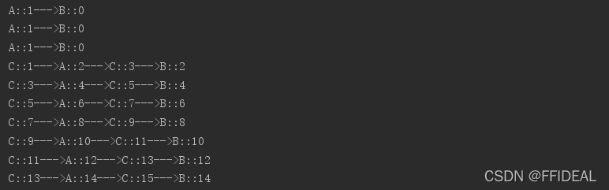
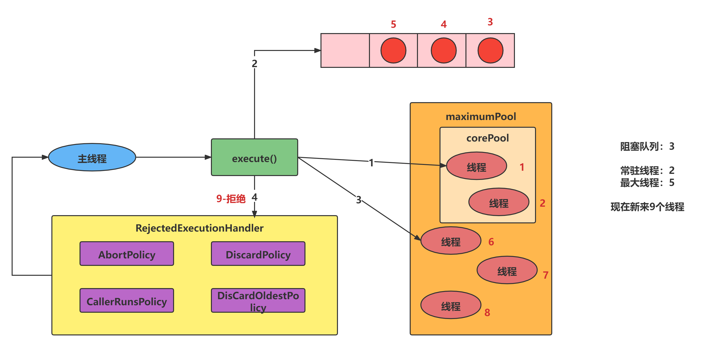

# Lock接口

**复习synchronized**

synchronized是Java的关键字，是一种同步锁，能够修饰 一个 对象，变量，方法，来控制这个所修饰的，被顺序的访问。


### 什么是Lock接口

Lock 接口介绍
Lock 实现提供比使用 `synchronized` 方法和语句可以获得的更广泛的锁定操作。它们允许更灵活的结构化，可能具有完全不同的属性，并且可以支持多个相关联的对象 `Condition` 。

当在不同范围内发生锁定和解锁时，必须注意确保在锁定时执行的所有代码由 try-finally 或 try-catch 保护，以确保在必要时释放锁定。
Lock 实现提供了使用 synchronized 方法和语句的附加功能，通过提供非阻塞尝试来获取锁 tryLock()，尝试获取可被中断的锁 lockInterruptibly() ，以及尝试获取可以超时 tryLock(long, TimeUnit)。


### 创建线程的多种方式

- 集成Thread类
- 实现 Runnable 接口
- 使用 Callable 接口
- 使用线程池


## synchronized和Lock两者差异

synchronized是java关键字，内置，而lock不是内置，是一个类，可以实现同步访问且比 synchronized中的方法更加丰富

synchronized不会手动释放锁，而lock需手动释放锁（不解锁会出现死锁，需要在 finally 块中释放锁）

lock等待锁的线程会相应中断，而synchronized不会相应，只会一直等待

通过 Lock 可以知道有没有成功获取锁，而 synchronized 却无法办到

Lock 可以提高多个线程进行读操作的效率（当多个线程竞争的时候）
锁会出现死锁，需要在 finally 块中释放锁）

lock等待锁的线程会相应中断，而synchronized不会相应，只会一直等待

通过 Lock 可以知道有没有成功获取锁，而 synchronized 却无法办到

Lock 可以提高多个线程进行读操作的效率（当多个线程竞争的时候）


# 线程间通信

线程间通信有两种实现方法：

关键字 `synchronized` 与 `wait()/notify()` 这两个方法一起使用可以实现等待/通知模式

`Lock` 接口中的 `newContition()` 方法返回 Condition 对象，Condition 类也可以实现等待/通知模式


1 用 notify() 通知时，JVM 会随机唤醒某个等待的线程

2 使用 Condition 类可以进行选择性通知， Condition 比较常用的两个方法：	

> > await() 会使当前线程等待,同时会释放锁,当其他线程调用 signal()时,线程会重新获得锁并继续执行
> >
> > signal() 用于唤醒一个等待的线程


### 虚假唤醒问题

虚假唤醒主要出现在多线程中出现。

````java
// 创建一个资源类
class Share{
    // 设置临界资源
    private int number = 0;

    // 实现+1操作
    public synchronized void incr() throws InterruptedException {
        // 操作：判断、干活、通知
        if (number != 0) {
            // number不为0，等待
            this.wait();
        }
        number++;
        System.out.print(Thread.currentThread().getName()+"::"+number+"--->");
        // 唤醒其他线程
        this.notifyAll();
    }

    // 实现-1操作
    public synchronized void decr() throws InterruptedException {
        // 操作：判断、干活、通知
        if (number != 1) {
            // number不为0，等待
            this.wait();
        }
        number--;
        System.out.println(Thread.currentThread().getName()+"::"+number);
        this.notifyAll();
    }
}
public class InterThreadCommunication {
    public static void main(String[] args) {
        Share share = new Share();

        new Thread(new Runnable() {
            @Override
            public void run() {
                try {
                    for (int i = 0; i < 100; i++) {
                        share.incr();
                    }

                } catch (InterruptedException e) {
                    e.printStackTrace();
                }
            }
        },"A").start();

        new Thread(new Runnable() {
            @Override
            public void run() {
                try {
                    for (int i = 0; i < 100; i++) {
                        share.decr();
                    }
                } catch (InterruptedException e) {
                    e.printStackTrace();
                }
            }
        },"B").start();

        new Thread(new Runnable() {
            @Override
            public void run() {
                try {
                    for (int i = 0; i < 100; i++) {
                        share.incr();
                    }

                } catch (InterruptedException e) {
                    e.printStackTrace();
                }
            }
        },"C").start();

            new Thread(new Runnable() {
            @Override
            public void run() {
                try {
                    for (int i = 0; i < 100; i++) {
                        share.decr();
                    }
                } catch (InterruptedException e) {
                    e.printStackTrace();
                }
            }
        },"D").start();
    }
}

```
````


输出结尾如下，显然最后输出的结果和我们预想的是不一样的。那么问题出在哪里呢？



> 在一个参数版本中，中断和虚假唤醒是可能的，并且该方法应该始终在循环中使用

也就是说，这种现象叫做【虚假唤醒】。所谓虚假唤醒，就是 wait()方法的一个特点，总结来说 wait() 方法使线程**在哪里睡就在哪里醒。**

当A判断 number 不为 0 时， 就会沉睡，当 A 再次抢到线程， 他会在沉睡的哪一行代码唤醒，导致不判断 number 是否等于 0 。直接进行 ++操作。

按照 JDK1.8 文档的提示，将资源类的 `incr()` 方法和 `decr()` 方法中的if语句改为循环语句，修改代码如下：

````java
// 创建一个资源类
class Share{
    // 设置临界资源
    private int number = 0;

    // 实现+1操作
    public synchronized void incr() throws InterruptedException {
        // 操作：判断、干活、通知
        while (number != 0) {
            // number不为0，等待
            // 哪里睡哪里起
            this.wait();
        }
        number++;
        System.out.print(Thread.currentThread().getName()+"::"+number+"--->");
        // 唤醒其他线程
        this.notifyAll();
    }

    // 实现-1操作
    public synchronized void decr() throws InterruptedException {
        // 操作：判断、干活、通知
        while (number != 1) {
            // number不为0，等待
            this.wait();
        }
        number--;
        System.out.println(Thread.currentThread().getName()+"::"+number);
        this.notifyAll();
    }
}
```
````


## 定制化通信

让线程按照制定的顺序工作，通过全局标志位可以控制。

demo：

````java
public class ThreadDemo2 {
    public static void main(String[] args) {
        Book2 book = new Book2();

        new Thread(() -> {
            try {
                book.add();
            } catch (InterruptedException e) {
                throw new RuntimeException(e);
            }

        }, "a").start();


        new Thread(() -> {
            try {
                book.remove();
            } catch (InterruptedException e) {
                throw new RuntimeException(e);
            }
        }, "b").start();
    }
}


@Data
class Book2 {
    private int number = 0;
    Lock lock = new ReentrantLock();
    Condition condition1 = lock.newCondition();
    Condition condition2 = lock.newCondition();

    public void add() throws InterruptedException {

        lock.lock();
        try {
            for (int i = 0; i < 10; i++) {
                System.out.println(Thread.currentThread().getName() + "::" + number);
                condition1.signalAll();
            }
        } finally {
            lock.unlock();
        }
    }

    public void remove() throws InterruptedException {
        lock.lock();
        try {
            for (int i = 0; i < 10; i++) {
                System.out.println(Thread.currentThread().getName() + "::" + number);
                condition2.signalAll();
            }
        } finally {
            lock.unlock();
        }
    }
}
```
````


# 线程集合问题

在学习集合线程安全之前，先来看一下为什么在多线程中会出现不安全。

以 ArrayList 为例，我们进入 ArrayList 源码，找到 add() 方法，源码如下

```java
public boolean add(E e) {
    ensureCapacityInternal(size + 1);  // Increments modCount!!
    elementData[size++] = e;
    return true;
}

```


显然，add() 方法没有使用同步互斥，所以在多线程并发是，会出现线程异常，测试代码如下

```java


public class SetUnsefertyTest {
    public static void main(String[] args) {
        // 创建ArrayList 集合
        ArrayList<String> list = new ArrayList<>();

        // 创建10个线程，往 list 中添加元素
        for (int i = 0; i < 10; i++) {
            new Thread(()->{
                // 向集合中添加内容
                list.add(UUID.randomUUID().toString().substring(0,8));
                // 从集合中取出内容
                System.out.println(list);
            },String.valueOf(i)).start();
        }
    }
}

```


解决该方法主要有三种，即使用这三个类：Vector、Collections、CopyOnWriteArrayList（常用）


**解决方案一 使用Vector**

```java
public synchronized boolean add(E e) {
    modCount++;
    ensureCapacityHelper(elementCount + 1);
    elementData[elementCount++] = e;
    return true;
}

```

但是 Vector 用的不多，因为每次对添加的元素上锁，而且使用的是重量级锁synchronized是十分占用资源的，效率是十分低下的。其用法和 ArrayList 一样。


**解决方案-Collections**

进入 Collections 的底层，找到 synchronizedList(List list) 方法，源代码如下，synchronizedList(List list) 方法返回指定列表支持的同步（线程安全的）列表。

```java
public static <T> List<T> synchronizedList(List<T> list) {
    return (list instanceof RandomAccess ?
            new SynchronizedRandomAccessList<>(list) :
            new SynchronizedList<>(list));
}

static <T> List<T> synchronizedList(List<T> list, Object mutex) {
    return (list instanceof RandomAccess ?
            new SynchronizedRandomAccessList<>(list, mutex) :
            new SynchronizedList<>(list, mutex));
}

```


对 Collections 的使用如下

```java
List<String> list = Collections.synchronizedList(new ArrayList<>());
// 将list集合以参数放入synchronizedList方法中
```


**解决方案-CopyOnWriteArrayList**

最常用的方法

CopyOnWriteArrayList涉及的底层原理为 **写时复制技术**

- 读的时候并发（多个线程操作）
- 写的时候独立，先复制相同的空间到某个区域，将其写到新区域，旧新合并，并且读新区域（每次加新内容都写到新区域，覆盖合并之前旧区域，读取新区域添加的内容）

进入 CopyOnWriteArrayList 底层，来看一下它是怎么实现的，其 add() 源代码如下

```java

public boolean add(E e) {
    // 声明一个重进入锁
    final ReentrantLock lock = this.lock;
    // 上锁
    lock.lock();
    try {
        // 获取原来的列表
        Object[] elements = getArray();
        // 获取原来列表的长度
        int len = elements.length;
        // 复制一个与原来的列表一样的列表
        Object[] newElements = Arrays.copyOf(elements, len + 1);
        // 将新加入的元素放到列表末尾
        newElements[len] = e;
        // 旧新合并
        setArray(newElements);
        return true;
    } finally {
        // 解锁
        lock.unlock();
    }
}

```

对 CopyOnWriteArrayList 的使用如下

```java
List<String> list = new CopyOnWriteArrayList<>();
```


**对上述三种方式的总结**

对比三者来看，Vector和Collections虽然也可以实现同步，但由于这两种方法在底层都使用了synchronized重量级锁，使其效率很低，**所以对 ArrayList 的同步主要采用 CopyOnWriteArrayList**

```java
/**
 * @author ZhangMinlei
 * @description 三种方式演示
 * @date 2023-07-31 12:49
 */
public class Demo1 {
    public static void main(String[] args) {
//        ArrayList<String> list = new ArrayList<String>();

//        List list = new Vector();
//        List list = Collections.synchronizedList(new ArrayList<>());
        List list = new CopyOnWriteArrayList();

        for (int i = 0; i < 30; i++) {
            new Thread(() -> {
                list.add(UUID.randomUUID().toString().substring(0, 5));
                System.out.println(list);
            }).start();
        }
    }
}

```


### HashSet的线程不安全

HashSet 同时读写时也会出现 ConcurrentModificationException 异常

进入 HashSet 底层，来看一下它是怎么实现的，其 add() 源代码如下

```java
public boolean add(E e) {
    return map.put(e, PRESENT)==null;
}

```

显然，他的问题和 ArrayList 一样，没有对 add(E e) 方法做同步处理

其解决方法与 CopyOnWriteArrayList 类似，在 JDK1.8 中，也有一个类叫做 CopyOnWriteArraySet ，其底层代码如下
```java
public boolean add(E e) {
    // private final CopyOnWriteArrayList<E> al;
    return al.addIfAbsent(e);
}
```


通过 Debug 找到了对关键的一个函数，发现其实现方式与 CopyOnWriteArrayList 底层实现方式类似

```java

// e 表示添加的元素
// snapshot 表示被复制的列表
private boolean addIfAbsent(E e, Object[] snapshot) {
    final ReentrantLock lock = this.lock;
    lock.lock();
    try {
        // 获取当前列表和列表长度
        Object[] current = getArray();
        int len = current.length;
        // 如果现在的列表和之前的列表不同，其实显然是不同的
        if (snapshot != current) {
            // Optimize for lost race to another addXXX operation
            // 取较小的长度列表
            int common = Math.min(snapshot.length, len);
            for (int i = 0; i < common; i++)
                if (current[i] != snapshot[i] && eq(e, current[i]))
                    return false;
            if (indexOf(e, current, common, len) >= 0)
                return false;
        }
        // 后面就是将其写到新区域，旧新合并
        Object[] newElements = Arrays.copyOf(current, len + 1);
        newElements[len] = e;
        setArray(newElements);
        return true;
    } finally {
        lock.unlock();
    }
}

```


对 CopyOnWriteArraySet 的使用如下

```java
CopyOnWriteArraySet<String> list = new CopyOnWriteArraySet<>();
```

## HashMap 安全问题

HashMap的线程不安全
HashMap 同时读写时一样会出现 ConcurrentModificationException 异常

进入 HashMap 底层，来看一下它是怎么实现的，其 put(K key, V value) 源代码如下

```java
public V put(K key, V value) {
    return putVal(hash(key), key, value, false, true);
}
```

对 ConcurrentHashMap 的使用如下

```java
ConcurrentHashMap<String, String> map = new ConcurrentHashMap<>();
```


------------------------------------------------


# Callable接口

### Callable接口创建线程

目前学习了有两种创建线程的方法，一种是通过创建 Thread 类，另一种是通过使用 Runnable 创建线程，但是，Runnable 缺少的一项功能是，当线程终止时（即 run()完成时），我们无法使线程返回结果。为了支持此功能，Java 中提供了 Callable 接口

>比较Runnable接口和Callable接口
>
>Callable中的call()计算结果，如果无法计算结果，会抛出异常
>
>Runnable中的run()使用实现接口Runnable的对象创建一个线程时，启动该线程将导致在独立执行的线程中调用该对象的run方法
>总的来说：run()没有返回值，不会抛出异常。而call()有返回值，会抛出异常


因为Thread的构造函数中没有Callable接口的参数设置,直接替换不可以，只能用下面这种线程创建方法（找一个类，即和Runnable接口有关系，又和Callable接口有关系）

```java
public class Demo {
    public static void main(String[] args) throws ExecutionException, InterruptedException {
//        FutureTask 需要Thread 启动。
        FutureTask<String> futureTask = new FutureTask<>(() -> "hello");
        new Thread(futureTask).start();
//        通过使用Get方法获的返回值
        System.out.println(futureTask.get());
    }
}
```


# Juc 强大辅助类


**该辅助类主要讲述三个**

1. 减少计数 CountDownLatch
2. 循环栅栏 CyclicBarrier
3. 信号灯 Semaphore


### **减少计数 CountDownLatch**

该类的构造方法为 `CountDownLatch(int count)` 构造一个用给定计数初始化的 `CountDownLatch` 

```java
public CountDownLatch(int count) {
    if (count < 0) throw new IllegalArgumentException("count < 0");
    this.sync = new Sync(count);
}

```

CountDownLatch 类可以设置一个计数器，然后通过 countDown 方法来进行减 1 的操作，使用 await 方法等待计数器不大于 0，然后继续执行 await 方法之后的语句。具体步骤可以演化为**定义一个类，减1操作，并等待到0，为0执行结果**。


**两个常用的主要方法**

await() 使用当前线程在锁存器倒计数至零之前一直在等待，除非线程被中断、

```java
public void await() throws InterruptedException {
    sync.acquireSharedInterruptibly(1);
}
```


countDown()递减锁存器的计数，如果计数达到零，将释放所有等待的线程

```java

public void countDown() {
    sync.releaseShared(1);
}
public final boolean releaseShared(int arg) {
    if (tryReleaseShared(arg)) {
        doReleaseShared();
        return true;
    }
    return false;
}

```

演示案例：

```java
//如果不使用CountDownLatch 会造成线程混乱，

public class JucAuxiliary {
    public static void main(String[] args) throws InterruptedException {
        CountDownLatch countDownLatch = new CountDownLatch(10);

        for (int i = 0; i < 10; i++) {
            int k = 0;
            new Thread(() -> {
                out.println(Thread.currentThread().getName()+ "离开");
                countDownLatch.countDown();
            }).start();
        }
        countDownLatch.await();
        //只有等到所有的线程结束完成之后，才会执行一下代码。
        out.println("全部离开~");
    }
}
```

### 循环栅栏 CyclicBarrier

该类是 **允许一组线程** 互相 等待，直到到达某个公共屏障点，在设计一组固定大小的线程的程序中，这些线程必须互相等待，因为barrier在释放等待线程后可以重用，所以称为循环barrier


常用的构造方法有：**CyclicBarrier(int parties，Runnable barrierAction)**，其底层代码如下

```java

public CyclicBarrier(int parties, Runnable barrierAction) {
    if (parties <= 0) throw new IllegalArgumentException();
    this.parties = parties;
    this.count = parties;
    // 最后需要执行的方法
    this.barrierCommand = barrierAction;
}

```


创建一个新的CyclicBarrier，它将在**给定数量的参与者**（线程）处于等待状态时启动，并在启动barrier时执行**给定的屏障操作，\**该操作由最后一个\**进入barrier的线程操作**


**常用的方法有：**

**await()** 在所有的参与者都已经在此barrier上调用await方法之前一直等待。

从底层代码可知， CyclicBarrier 的构造方法第一个参数是目标障碍数，每次执行 CyclicBarrier 一次障碍数会+1，如果达到了目标障碍数，才会执行 cyclicBarrier.await()之后的语句。可以将 CyclicBarrier 理解为+1 操作（指与目标障碍数的距离）
------------------------------------------------
演示案例：

```java
@Test
    public void test() {
//        只有当await方法 达到数字屏障之后，才会执行 CyclicBarrier 的方法。
        int number = 7;
        CyclicBarrier cyclicBarrier = new CyclicBarrier(number, () -> {
            out.println("可以召唤神龙了~");
        });

        for (int i = 0; i < 7; i++) {
            new Thread(() -> {
                out.println(Thread.currentThread().getName() + "集齐了龙珠~");
                try {
                    cyclicBarrier.await();
                } catch (InterruptedException e) {
                    throw new RuntimeException(e);
                } catch (BrokenBarrierException e) {
                    throw new RuntimeException(e);
                }
            }).start();
        }
    }
```

###  信号灯 Semaphore

一个计数信号量，从概念上讲，信号量维护了一个许可集，如有必要，在许可可用前会阻塞每一个acquire()，然后在获取该许可。每个release()添加一个许可，从而可能释放一个正在阻塞的获取者。但是，不使用实际的许可对象，Semaphore只对可用许可的号码进行计数，并采取相应的行动

**具体常用的构造方法有：**

Semaphore(int permits) 创建具有给定的许可数和非公平的公平设置的Semapore

```java
public Semaphore(int permits) {
    // 默认创建非公平锁
    sync = new NonfairSync(permits);
}
public Semaphore(int permits, boolean fair) {
    // fair为true时，为公平锁
    sync = fair ? new FairSync(permits) : new NonfairSync(permits);
}
```


**具体常用的方法有：**

acquire()从此信号量获取一个许可，在提供一个许可前一直将线程阻塞，否则线程被中断

release()释放一个许可，将其返回给信号量

```java
public void acquire() throws InterruptedException {
    // 阻塞当前线程
    sync.acquireSharedInterruptibly(1);
}
public void release() {
    // 释放一个许可
    sync.releaseShared(1);
}

```


设置许可数量 `Semaphore semaphore = new Semaphore(3);`

一般 acquire(）都会抛出异常，release 在 finally 中执行

___

案例演示

```java
public class JucAuxiliary {
    public static void main(String[] args) throws InterruptedException {
        Semaphore semaphore = new Semaphore(3);
        for (int i = 0; i < 6; i++) {
            new Thread(() -> {
                try {
                    try {
                        semaphore.acquire();
                    } catch (InterruptedException e) {
                        throw new RuntimeException(e);
                    }
                    out.println(Thread.currentThread().getName() + "抢到了车位");
                    try {
                        TimeUnit.SECONDS.sleep(2);
                        out.println(Thread.currentThread().getName() + "离开了车位");
                    } catch (InterruptedException e) {
                        throw new RuntimeException(e);
                    }
                } finally {
                    semaphore.release();
                }
            }).start();
        }
    }
```


# 堵塞队列

在Java中，阻塞队列（Blocking Queue）是一种特殊类型的队列，它具有一些额外的特性，使得队列在特定情况下能够阻塞线程，以实现线程之间的协调和同步。阻塞队列在多线程编程中起到了重要的作用，它的主要作用包括以下几个方面：

1. 线程间通信：阻塞队列允许一个线程将数据存放在队列中，而另一个线程从队列中取出数据。这样不同的线程之间可以通过阻塞队列进行数据交换，从而实现线程间的通信和数据共享。

2. 同步：阻塞队列本身是线程安全的数据结构，它内部实现了对队列的访问同步控制。多个线程可以安全地对队列进行存入和取出操作，而不需要显式地加锁和解锁。

3. 解耦生产者和消费者：使用阻塞队列可以实现生产者-消费者模式，生产者将数据放入队列中，而消费者从队列中取出数据。这样，生产者和消费者可以在不影响对方的情况下并行执行，提高了程序的并发性和效率。

4. 控制系统吞吐量：阻塞队列可以用于控制系统的负载和吞吐量。当队列已满时，生产者线程会被阻塞，直到队列有空间可以存放数据；当队列为空时，消费者线程会被阻塞，直到队列中有数据可供消费。这样可以有效平衡生产者和消费者之间的速度差异，避免系统资源的过度占用。

Java中提供了多种类型的阻塞队列，包括`ArrayBlockingQueue`、`LinkedBlockingQueue`、`PriorityBlockingQueue`等，每种队列都有其适用的场景和性能特点。开发者可以根据具体需求选择合适的阻塞队列来实现线程间的数据共享和协调。


### 堵塞队列的分裂

1 ArrayBlockingQueue（常用）

> 基于数组的阻塞队列
>
> 由数组结构组成的有界阻塞队列
>
> ArrayBlockingQueue 在生产者放入数据和消费者获取数据，都是共用同一个锁对象，无法并行


2 LinkedBlockingQueue（常用）

>基于链表的阻塞队列
>
>由链表结构组成的有界（但大小默认值为Integer.MAX_VALUE）阻塞队列
>
>之所以能够高效的处理并发数据，还因为其对于生产者端和消费者端分别采用了独立的锁来控制数据同步，这也意味着在高并发的情况下生产者和消费者可以并行地操作队列中的数据，以此来提高整个队列的并发性能


3 DelayQueue

>使用优先级队列实现的延迟无界阻塞队列
>
>DelayQueue 中的元素只有当其指定的延迟时间到了，才能够从队列中获取到该元素。
>
>DelayQueue 是一个没有大小限制的队列，因此往队列中插入数据的操作（生产者）永远不会被阻塞，而只有获取数据的操作（消费者）才会被阻塞


4 PriorityBlockingQueue

> 基于优先级的阻塞队列
>
> 支持优先级排序的无界阻塞队列
>
> 不会阻塞数据生产者，而只会在没有可消费的数据时，阻塞数据的消费者


5 SynchronousQueue

>一种无缓冲的等待队列
>
>相对于有缓冲的 BlockingQueue 来说，少了一个中间经销商的环节（缓冲区）
>
>不存储元素的阻塞队列，也即单个元素的队列

声明一个 SynchronousQueue 有两种不同的方式，它们之间有着不太一样的行为。公平模式和非公平模式的区别:

- 公平模式：SynchronousQueue 会采用公平锁，并配合一个 FIFO 队列来阻塞，多余的生产者和消费者，从而体系整体的公平策略；

- 非公平模式（SynchronousQueue 默认）：SynchronousQueue 采用非公平锁，同时配合一个 LIFO 队列来管理多余的生产者和消费者

------------------------------------------------
6 LinkedTransferQueue

>由链表结构组成的无界阻塞 TransferQueue 队列
>
>由链表组成的无界阻塞队列
>
>预占模式。 意思就是消费者线程取元素时，如果队列不为空，则直接取走数据，若队列为空，生成一个节点（节点元素为 null）入队，消费者线程被等待在这个节点上，生产者线程入队时发现有一个元素为 null 的节点，生产者线程就不入队了，直接就将元素填充到该节点，并唤醒该节点等待的线程，被唤醒的消费者线程取走元素，从调用的方法返回


7 LinkedBlockingDeque

> 由链表结构组成的双向阻塞队列
>
> 阻塞有两种情况
>
> 插入元素时：如果当前队列已满将会进入阻塞状态，一直等到队列有空的位置时再该元素插入，该操作可以通过设置超时参数，超时后返回 false 表示操作失败，也可以不设置超时参数一直阻塞，中断后抛出 InterruptedException异常
> 读取元素时：如果当前队列为空会阻塞住直到队列不为空然后返回元素，同样可以通过设置超时参数


### 阻塞队列核心方法

这里指的是四种不同的添加 取出方法，功能是相同的，结果是不同的。

| 方法类型 | 抛出异常  | 特殊值  | 阻塞   | 超时               |
| -------- | --------- | ------- | ------ | ------------------ |
| 插入     | add(e)    | offer() | put(e) | offer(e,time,unit) |
| 移除     | remove()  | poll()  | take() | poll(time,unit)    |
| 检查     | element() | peek()  | -      | -                  |

| 抛出异常   | 当阻塞队列满时，再往队列里add插入元素会抛出IllegalStateException:Queue full<br/>当阻塞队列空时，再往队列里remove移除元素会抛出NoSuchElementException<br/>特殊值	插入方法，成功true，失败false<br/>移除方法，成功返回出队列的元素，列表里没有就返回null<br/>阻塞	当阻塞队列满时，生产者线程继续往队列里put元素，队列会一直阻塞生产者线程知道put数据或响应中断退出<br/>当阻塞队列空时，消费者线程视图从队列里take元素，队列会一直阻塞消费者线程直到队列可用<br/>超时	当阻塞队列满时，队列会阻塞生产者线程一定时间，超过限时后生产者线程会退出 |
| ---------- | ------------------------------------------------------------ |
| **特殊值** | 插入方法，成功true，失败false<br/>移除方法，成功返回出队列的元素，列表里没有就返回null |
| **阻塞**   | 当阻塞队列满时，生产者线程继续往队列里put元素，队列会一直阻塞生产者线程知道put数据或响应中断退出<br/>当阻塞队列空时，消费者线程视图从队列里take元素，队列会一直阻塞消费者线程直到队列可用 |
| **超时**   | 当阻塞队列满时，队列会阻塞生产者线程一定时间，超过限时后生产者线程会退出 |

# 线程池

Java线程池是一种用于管理和复用线程的机制，它可以帮助提高多线程应用程序的性能和效率。在Java中，线程的创建和销毁是一种昂贵的操作，频繁地创建和销毁线程会带来较大的开销。使用线程池可以通过重用现有线程来避免这种开销，从而提高系统的响应速度和资源利用率。

线程池提供了统一的任务提交接口，用户只需要将任务提交给线程池，线程池会根据其类型和当前状态来选择合适的线程执行任务。另外，线程池还提供了一些其他功能，如定时执行任务、获取任务执行结果、关闭线程池等。

**线程池的优点：**

1. 降低资源消耗: 通过重复利用已创建的线程降低线程创建和销毁造成的销耗。
2. 提高响应速度: 当任务到达时，任务可以不需要等待线程创建就能立即执行。
3. 提高线程的可管理性: 线程是稀缺资源，如果无限制的创建，不仅会销耗系统资源，还会降低系统的稳定性，使用线程池可以进行统一的分配，调优和监控。


### 线程池架构

Java中线程池主要由`Executor`框架和相关的接口和类组成，其中`ExecutorService`是一个接口，用于定义线程池的核心功能。通过`Executors`类可以方便地创建不同类型的线程池。常见的线程池类型包括：

1. `FixedThreadPool`: 创建一个固定大小的线程池，该线程池中的线程数量是固定的。当有新的任务提交时，如果线程池中有空闲线程，任务会被立即分配给一个空闲线程执行，否则任务会被放入队列等待，直到有线程空闲为止。

2. `CachedThreadPool`: 创建一个可缓存的线程池，该线程池中的线程数量会根据任务的数量动态调整。当有新的任务提交时，如果线程池中有空闲线程，任务会被立即分配给一个空闲线程执行，如果没有空闲线程，会创建一个新的线程来执行任务。同时，当线程空闲时间超过一定阈值，线程会被回收，以减少资源消耗。

3. `SingleThreadPool`: 创建一个只有一个线程的线程池，该线程池用于顺序执行任务，保证所有任务按照提交的顺序执行。


线程池使用方式
`Executors.newFixedThreadPool(int)`：一池N线程

```java
ExecutorService threadPool1 = Executors.newFixedThreadPool(5); //5个窗口
```


`Executors.newSingleThreadExecutor()`：一池一线程

```java
ExecutorService threadPool2 = Executors.newSingleThreadExecutor(); //一个窗口1
```


`Executors.newCachedThreadPool()`：一池可扩容根据需求创建线程

```java
 ExecutorService threadPool3 = Executors.newCachedThreadPool();
```


**执行线程**：`execute()`
**关闭线程**：`shutdown()`

**`void execute(Runnable command);`参数为Runnable接口类，可以通过设置lambda**


案例演示：

```java
public class PoolTest {
    public static void main(String[] args) {
        ExecutorService executorService = Executors.newFixedThreadPool(5);
        ExecutorService executorService1 = Executors.newSingleThreadExecutor();
        ExecutorService executorService2 = Executors.newCachedThreadPool();
        try {
            for (int i = 0; i < 10; i++) {
                executorService2.execute(() -> {
                    System.out.println(Thread.currentThread().getName() + "办理业务");
                });
            }
        } finally {
            executorService2.shutdown();
        }

    }
}
```


### 线程池底层原则

通过查看上面三种方式创建对象的类源代码
都有 `new ThreadPoolExecutor` 具体查看该类的源代码，涉及七个参数

```java
public ThreadPoolExecutor(int corePoolSize,
                          int maximumPoolSize,
                          long keepAliveTime,
                          TimeUnit unit,
                          BlockingQueue<Runnable> workQueue,
                          ThreadFactory threadFactory,
                          RejectedExecutionHandler handler) {
    if (corePoolSize < 0 ||
        maximumPoolSize <= 0 ||
        maximumPoolSize < corePoolSize ||
        keepAliveTime < 0)
        throw new IllegalArgumentException();
    if (workQueue == null || threadFactory == null || handler == null)
        throw new NullPointerException();
    this.acc = System.getSecurityManager() == null ?
        null :
    AccessController.getContext();
    // 常驻线程数量（核心）
    this.corePoolSize = corePoolSize;
    // 最大线程数量
    this.maximumPoolSize = maximumPoolSize;
    // 阻塞队列（排队的线程放入）
    this.workQueue = workQueue;
    // 线程存活时间
    this.keepAliveTime = unit.toNanos(keepAliveTime);
    // 线程工厂，用于创建线程 线程工厂，用于创建线程
    this.threadFactory = threadFactory;
    // 拒绝测试（线程满了
    this.handler = handler;
}

```

###  线程池的七个参数

>int corePoolSize，常驻线程数量（核心）
>
>int maximumPoolSize，最大线程数量
>
>long keepAliveTime,TimeUnit unit，线程存活时间
>
>BlockingQueue workQueue，阻塞队列（排队的线程放入）
>
>ThreadFactory threadFactory，线程工厂，用于创建线程
>
>RejectedExecutionHandler handler，拒绝测试（线程满了）


具体工作流程是：

1. 在执行创建对象的时候不会创建线程，创建线程的时候execute(）才会创建
2. 先到常驻线程，满了之后再到阻塞队列进行等待，阻塞队列满了之后，在往外扩容线程，扩容线程不能大于最大线程数。大于最大线程数和阻塞队列之和后，会执行拒绝策略。
3. 阻塞队列为3，常驻线程数2，最大线程数5 


### 线程池底层工作流程




**对流程图的解释:**

现在假设来了9个线程，在执行execute()方法才创建线程。

第1-2个线程进入线程池创建

第3-5个线程进入阻塞队列

第6-8个线程会为他们创建新线程执行（直接运行线程6而非线程3）

第9个线程会被拒绝

总结来说：先到常驻线程，满了之后再到阻塞队列进行等待，阻塞队列满了之后，在往外扩容线程，扩容线程不能大于最大线程数。大于最大线程数和阻塞队列之和后，会执行拒绝策略。
------------------------------------------------
**具体的拒绝策略有：**

- 抛异常-AbortPolicy(默认)：直接抛出RejectedExecutionException异常阻止系统正常运行
- 谁调用找谁-CallerRunsPolicy：“调用者运行”一种调节机制，该策略既不会抛弃任务，也不会抛出异常，而是将某些任务回退到调用者，从而降低新任务的流量
- 抛弃最久执行当前-DiscardOldestPolicy：抛弃队列中等待最久的任务，然后把当前任务加入队列中，尝试再次提交当前任务
- 不理不问-Policydiscard：该策略默默地丢弃无法处理的任务，不予任何处理也不抱出异常。如果允许任务丢失，这是最好的一种策略


### 自定义线程池

实际在开发中不允许使用Executors创建，而是通过ThreadPoolExecutor的方式，规避资源耗尽风险

说明：Executors 返回的线程池对象的弊端如下：

1）FixedThreadPool 和 SingleThreadPool:

允许的请求队列长度为 Integer.MAX_VALUE，可能会堆积大量的请求，从而导致 OOM。

2）CachedThreadPool 和 ScheduledThreadPool:

允许的创建线程数量为 Integer.MAX_VALUE，可能会创建大量的线程，从而导致 OOM

```java
ExecutorService threadPool = new ThreadPoolExecutor(
    // 常驻核心线程
        2,
    // 最大线程数量
        5,
    // 线程存活时间
        2L,
        TimeUnit.SECONDS,
    // 阻塞队列
        new ArrayBlockingQueue<>(3),
    // 线程工厂
        Executors.defaultThreadFactory(),
    // 拒绝策略
        new ThreadPoolExecutor.AbortPolicy()
);
```


**其他都同理，只是调用ThreadPoolExecutor类，自定义参数**

```java
public class ThreadPoolTest {
    public static void main(String[] args) {
        // 组定义线程池
        ExecutorService threadPool = new ThreadPoolExecutor(
                // 常驻线程数量（核心）2个
                2,
                // 最大线程数量5个
                5,
                // 线程存活时间:2秒
                2L,
                TimeUnit.SECONDS,
                // 阻塞队列
                new ArrayBlockingQueue<>(3),
                // 默认线程工厂
                Executors.defaultThreadFactory(),
                // 拒绝策略。抛出异常
                new ThreadPoolExecutor.AbortPolicy()
        );

        try{
            for (int i = 1; i <= 8; i++) {
                threadPool.execute(()->{
                    System.out.println(Thread.currentThread().getName()+" 办理业务");
                });
            }
        }catch (Exception e){
            e.printStackTrace();
        }finally {
            // 关闭线程池
            threadPool.shutdown();
        }
    }
}

```

如果线程数大于 最 大 线 程 数 量 + 阻 塞 队 列 容 量 最大线程数量+阻塞队列容量最大线程数量+阻塞队列容量 则抛出异常

## Fork 与 Join分支

将一个大的任务拆分成多个子任务进行并行处理，最后将子任务结果合并成最后的计算结果。

该算法相当于递归，且是[二分查找](https://so.csdn.net/so/search?q=二分查找&spm=1001.2101.3001.7020)思路

```java
class Fibonacci extends RecursiveTask<Integer> {
   final int n;
   Fibonacci(int n) { this.n = n; }
   Integer compute() {
     if (n <= 1)
        return n;
     Fibonacci f1 = new Fibonacci(n - 1);
     // 分支
     f1.fork();
     Fibonacci f2 = new Fibonacci(n - 2);
     // 合并
     return f2.compute() + f1.join();
   }
 }

```


> Fork：把一个复杂任务进行分拆，大事化小
>
> Join：把分拆任务的结果进行合并


ForkJoinTask：我们要使用 Fork/Join 框架，首先需要创建一个 ForkJoin 任务。该类提供了在任务中执行 fork 和 join 的机制。通常情况下我们不需要直接集成 ForkJoinTask 类，只需要继承它的子类，Fork/Join 框架提供了两个子类：

RecursiveAction：用于没有返回结果的任务

RecursiveTask：用于有返回结果的任务

ForkJoinPool：ForkJoinTask 需要通过 ForkJoinPool 来执行

RecursiveTask：继承后可以实现递归(自己调自己)调用的任务

创建分支合并对象 通过该对象调用内部方法
------------------------------------------------
**具体案例：1加到100，相加两个数值不能大于10**

```java
class MyTask extends RecursiveTask<Integer> {

    // 拆分差值不能超过10
    private static final Integer VALUE  = 10;
    private int begin;
    private int end;
    private int result;

    public MyTask(int begin, int end){
        this.begin = begin;
        this.end = end;
    }

    @Override
    protected Integer compute() {
        // 判断两个值的差值是否大于10
        if((end-begin)<=10) {
            // 相加操作
            for (int i = begin; i <= end ; i++) {
                result = result + i;
            }
        } else {
            // 大于10 继续拆分
            int middle = (begin + end) / 2;
            // 拆分左边
            MyTask task01 = new MyTask(begin, middle);
            // 拆分右边
            MyTask task02 = new MyTask(middle + 1, end);
            // 调用方法拆分
            task01.fork();
            task02.fork();
            // 合并结果
            result = task01.join() + task02.join();
        }
        return result;
    }
}

public class ForkJoinTest {
    public static void main(String[] args) throws ExecutionException, InterruptedException {
        // 创建MyTask对象
        MyTask task = new MyTask(0, 100);
        // 创建分支合并池对象
        ForkJoinPool forkJoinPool = new ForkJoinPool();
        ForkJoinTask<Integer> forkJoinTask = forkJoinPool.submit(task);

        // 获取最终合并之后结果
        Integer reslut = forkJoinTask.get();
        System.out.println(reslut);
    }
}


```


## 异步回调

同步：指等待资源（阻塞）

异步：指设立[哨兵](https://so.csdn.net/so/search?q=哨兵&spm=1001.2101.3001.7020)，资源空闲通知线程，否则该线程去做其他事情（非阻塞）

###  CompletableFuture

CompletableFuture 在 Java 里面被用于[异步编程](https://so.csdn.net/so/search?q=异步编程&spm=1001.2101.3001.7020)，异步通常意味着非阻塞，可以使得我们的任务单独运行在与主线程分离的其他线程中，并且通过回调可以在主线程中得到异步任务的执行状态，是否完成，和是否异常等信息


CompletableFuture 实现了 Future, CompletionStage 接口，实现了 Future接口就可以兼容现在有线程池框架，而 CompletionStage 接口才是异步编程的接口抽象，里面定义多种异步方法，通过这两者集合，从而打造出了强大的CompletableFuture 类：
- 异步调用没有返回值方法runAsync
- 异步调用有返回值方法supplyAsync

CompletableFuture 是 Thread 的升级